# 垃圾文本检测

## 1. 系统概述

本系统专注于中文文本处理与分类，借助字音和字形的相似性，构建了一套全面的中文文本分析框架。系统包含汉字编码、相似性计算、文本预处理、特征向量生成以及分类评估等多个模块。

## 2. 代码说明

### 2.1 代码架构
```bash
2025_Junk_text_Detection/
├─ data/                            # 存放所有外部数据文件
│  ├─ chinese_unicode_table.txt     # 汉字 Unicode 编码与笔画等信息对照表
│  ├─ dataset.txt                   # 带标签的垃圾／正常短信语料集（标签\t文本）
│  ├─ hanzi.txt                     # 语料中出现的汉字及其拼音／笔画编码与出现次数
│  ├─ hanzijiegou_2w.txt            # 汉字结构（部件）对照表，用于生成字形编码
│  └─ hit_stopwords.txt             # 停用符号／标点列表，用于分词过滤
├─ four_corner_method/              # 「四角号码」编码方法的实现，供 utils.py 调用
├─ main.py                          # 主脚本：数据读取→清洗→分词→字嵌入→句向量→训练分类器
├─ ssc_similarity.py                # 声形码相似度计算：字音/字形编码相似性函数
├─ utils.py                         # 工具集：汉字编码、统计、相似矩阵构建与加载等
└─ README.md                        # 项目说明与使用指南
```

### 2.2 核心功能文件

`main.py`把所有训练样本的「句向量」当作特征（train_word_vectors），对应的标签当作目标，喂给 LogisticRegression 做训练； 测试时也是把测试样本的句向量（test_word_vectors）输入到同一个训练好的模型里，输出预测标签。
预测标签就是分类器对每条短信判断后的类别标识，0：表示“正常”短信；1：表示“垃圾”短信。

流程：字级别 Word2Vec → 声形相似度加权 → 动态路由句向量 → LogReg

- `ssc_similarity.py`：负责计算汉字之间的字音和字形相似性。它会综合字音编码和字形编码的相似度，得出最终的相似性得分。
- `utils.py`：包含一系列实用工具函数，像汉字编码生成、统计汉字出现次数、构建并加载相似性矩阵等操作都由其完成。
- `four_corner_method/__init__.py`：这是一个独立的模块，用于查询汉字的四角编码，其内部预先加载了四角编码数据。
- `main.py`：作为项目的主程序，它整合了数据读取、文本预处理、特征向量生成、模型训练以及分类评估等全流程操作


### 2.3 数据文件夹

- `data/`：存放训练和测试所需的数据集。

## 3. 安装与使用指南

### 3.1 环境依赖

- Python 3.7 及以上版本
- 所需 Python 库
  ```plaintext
  numpy
  pandas
  scikit-learn
  gensim
  pypinyin
  tqdm
  ```

### 3.2 安装步骤

1. 克隆本项目仓库
2. 安装必要的依赖库

```bash
pip install -r requirements.txt
```

## 4. 改进

### 4.1 缓存声形相似度矩阵

在运行`main.py`过程中可以发现运行下述两步时：
1. Counting characters：遍历所有文本，为每一行里的每个汉字累加出现次数。
2. Computing Character Code：对上一步统计出来的每个不同汉字，逐个调用 ChineseCharacterCoder().generate_character_code（拼音＋四角码＋笔画码），并把结果写入 hanzi.txt。

因为汉字种类只有几千个，这一步在 CPU 上要跑 O(#chars × 编码开销) 大约十几分钟。

我们可以尝试把中间产物（hanzi.txt 和 similarity_matrix.pkl）都存到 res/ 目录下，后续每次运行时：
1. 如果 res/hanzi.txt 已存在，就直接调用 load_chinese_characters 读入，跳过“Counting”+“Computing Character Code”；
2. res/similarity_matrix.pkl 已存在，就直接 load_sim_mat 读入，跳过“compute_sim_mat”；

只在这些缓存文件不存在时，才调用原来的耗时函数并写入缓存。

### 4.2 提出新模型

## 5. 过程记录
```bash
# MODE = 1 表示“单数据集模式”：对 SINGLE_DATA 做 50/50 划分训练/测试
# MODE = 2 表示“交叉数据集模式”：用 TRAIN_DATA 训练，用 TEST_DATA 测试
MODE = 1

# 如果 MODE == 1，脚本会使用 SINGLE_DATA 做划分
SINGLE_DATA = 'big_dataset.txt'

# 如果 MODE == 2，脚本会用 TRAIN_DATA 做训练，用 TEST_DATA 做测试
TRAIN_DATA = 'big_dataset.txt'
TEST_DATA = 'dataset.txt'
```
### 5.1 源代码：原始数据集 `dataset.txt` mode1: 55划分
```bash
[10:22:58] [INFO] 读取数据: data/dataset.txt
[10:22:58] [INFO] ✔︎ 共读取 16007 行样本
[10:22:58] [INFO] 训练样本=8003，测试样本=8004

混淆矩阵：
[[2014  486]
 [ 211 5293]]
[10:28:08] [INFO] 
分类报告：
              precision    recall  f1-score   support

           0      0.905     0.806     0.852      2500
           1      0.916     0.962     0.938      5504

    accuracy                          0.913      8004
   macro avg      0.911     0.884     0.895      8004
weighted avg      0.913     0.913     0.911      8004

[10:28:08] [INFO] 🎉  任务完成！
[10:28:08] [INFO] 🔔 脚本总耗时：0小时05分09秒
```

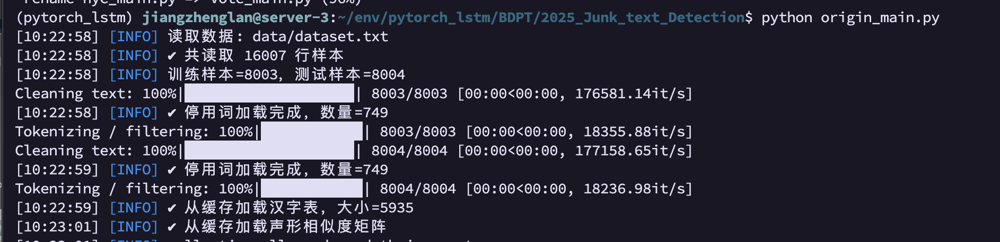
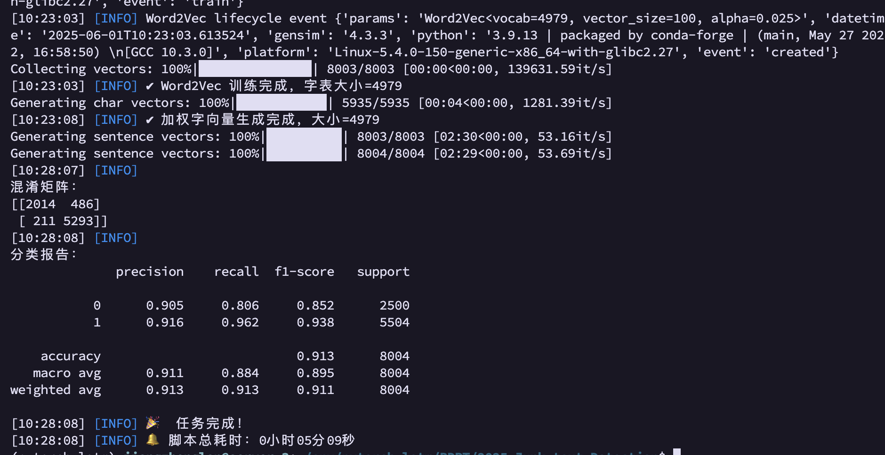

### 5.2 源代码：原始数据集 `big_dataset.txt` mode1: 55划分
```bash
[10:30:51] [INFO] 读取数据: data/big_dataset.txt
[10:30:53] [INFO] ✔︎ 共读取 799998 行样本
[10:30:53] [INFO] 训练样本=399999，测试样本=399999

[10:31:30] [INFO] ✔︎ 加权字向量生成完成，大小=4700
Generating sentence vectors: 100%|█████| 399999/399999 [11:09<00:00, 597.66it/s]
Generating sentence vectors: 100%|█████| 399999/399999 [11:07<00:00, 599.45it/s]
[10:53:50] [INFO] 
混淆矩阵：
[[356075   3924]
 [ 10607  29393]]
[10:53:51] [INFO] 
分类报告：
              precision    recall  f1-score   support

           0      0.971     0.989     0.980    359999
           1      0.882     0.735     0.802     40000

    accuracy                          0.964    399999
   macro avg      0.927     0.862     0.891    399999
weighted avg      0.962     0.964     0.962    399999

[10:53:51] [INFO] 🎉  任务完成！
[10:53:51] [INFO] 🔔 脚本总耗时：0小时23分00秒
```

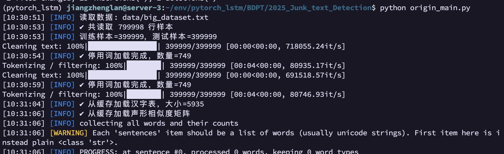
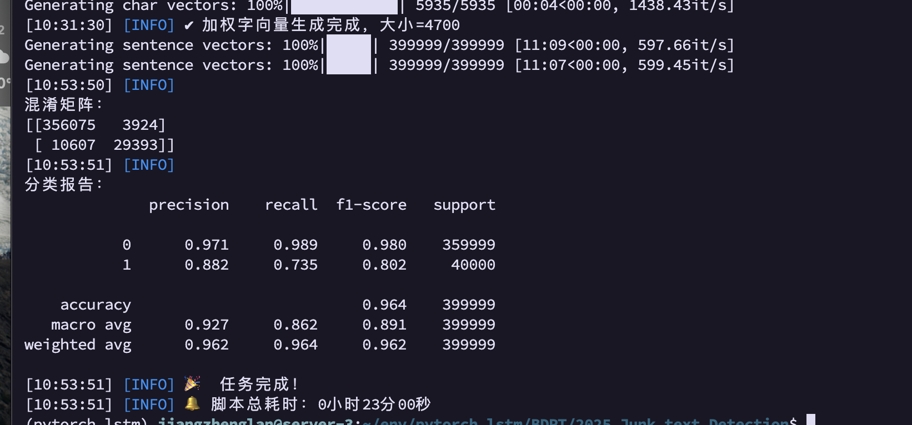

### 5.3 源代码：mode2: `big_dataset.txt`训练，`dataset.txt`测试
```bash
[10:54:47] [INFO] 读取数据: data/big_dataset.txt
[10:54:49] [INFO] ✔︎ 共读取 799998 行样本
[10:54:49] [INFO] 读取数据: data/dataset.txt
[10:54:49] [INFO] ✔︎ 共读取 16007 行样本
[10:54:49] [INFO] 训练样本=799998，测试样本=16007

[10:55:42] [INFO] ✔︎ Word2Vec 训练完成，字表大小=7705
Generating char vectors: 100%|████████████| 5935/5935 [00:04<00:00, 1325.39it/s]
[10:55:46] [INFO] ✔︎ 加权字向量生成完成，大小=4829
Generating sentence vectors: 100%|█████| 799998/799998 [24:04<00:00, 553.69it/s]
Generating sentence vectors: 100%|████████| 16007/16007 [05:23<00:00, 49.54it/s]
[11:25:21] [INFO] 
混淆矩阵：
[[ 749 4251]
 [4800 6207]]
[11:25:22] [INFO] 
分类报告：
              precision    recall  f1-score   support

           0      0.135     0.150     0.142      5000
           1      0.594     0.564     0.578     11007

    accuracy                          0.435     16007
   macro avg      0.364     0.357     0.360     16007
weighted avg      0.450     0.435     0.442     16007

[11:25:22] [INFO] 🎉  任务完成！
[11:25:22] [INFO] 🔔 脚本总耗时：0小时30分34秒
```
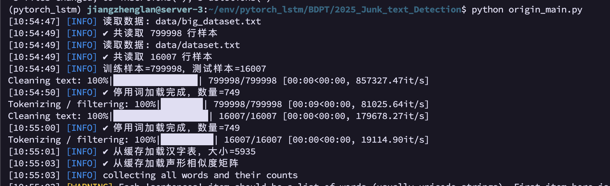
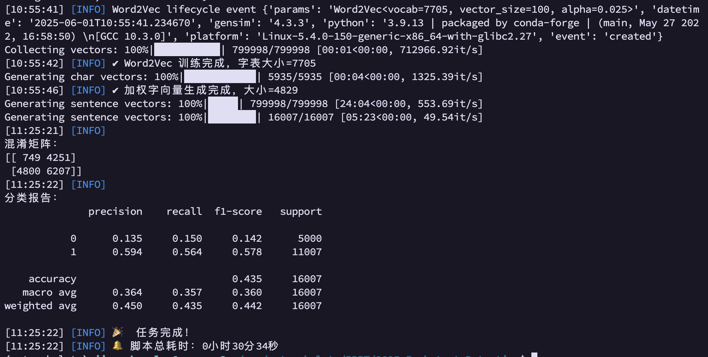

### 5.4 新模型：原始数据集 `dataset.txt` mode1: 55划分
```bash
Tokenizing: 100%|██████████████████████████████████████████████████████████| 16007/16007 [00:00<00:00, 78153.22it/s]

==== TF-IDF char1-3 + LinearSVC ====
耗时: 1.46s
Accuracy: 0.9927536231884058
Macro-F1: 0.9915618655476506
混淆矩阵:
 [[2469   31]
 [  27 5477]]
分类报告:
               precision    recall  f1-score   support

           0      0.989     0.988     0.988      2500
           1      0.994     0.995     0.995      5504

    accuracy                          0.993      8004
   macro avg      0.992     0.991     0.992      8004
weighted avg      0.993     0.993     0.993      8004


==== TF-IDF char1-3 + LogisticRegression ====
耗时: 2.64s
Accuracy: 0.9891304347826086
Macro-F1: 0.98728540580049
混淆矩阵:
 [[2434   66]
 [  21 5483]]
分类报告:
               precision    recall  f1-score   support

           0      0.991     0.974     0.982      2500
           1      0.988     0.996     0.992      5504

    accuracy                          0.989      8004
   macro avg      0.990     0.985     0.987      8004
weighted avg      0.989     0.989     0.989      8004


==== HashingVectorizer char1-3 + SGDClassifier ====
耗时: 0.92s
Accuracy: 0.9922538730634682
Macro-F1: 0.9909400334233327
混淆矩阵:
 [[2447   53]
 [   9 5495]]
分类报告:
               precision    recall  f1-score   support

           0      0.996     0.979     0.987      2500
           1      0.990     0.998     0.994      5504

    accuracy                          0.992      8004
   macro avg      0.993     0.989     0.991      8004
weighted avg      0.992     0.992     0.992      8004


==== TF-IDF char1-5 + MultinomialNB ====
耗时: 2.62s
Accuracy: 0.9901299350324838
Macro-F1: 0.988545308571126
混淆矩阵:
 [[2474   26]
 [  53 5451]]
分类报告:
               precision    recall  f1-score   support

           0      0.979     0.990     0.984      2500
           1      0.995     0.990     0.993      5504

    accuracy                          0.990      8004
   macro avg      0.987     0.990     0.989      8004
weighted avg      0.990     0.990     0.990      8004


==== Word2Vec-avg + LogisticRegression ====
耗时: 6.05s
Accuracy: 0.9780109945027486
Macro-F1: 0.9745761004978067
混淆矩阵:
 [[2443   57]
 [ 119 5385]]
分类报告:
               precision    recall  f1-score   support

           0      0.954     0.977     0.965      2500
           1      0.990     0.978     0.984      5504

    accuracy                          0.978      8004
   macro avg      0.972     0.978     0.975      8004
weighted avg      0.978     0.978     0.978      8004
```

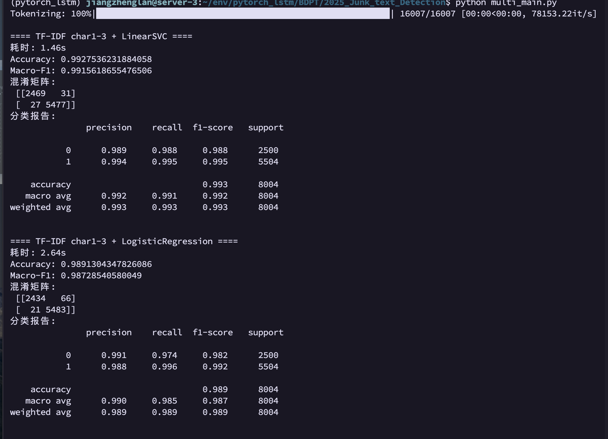
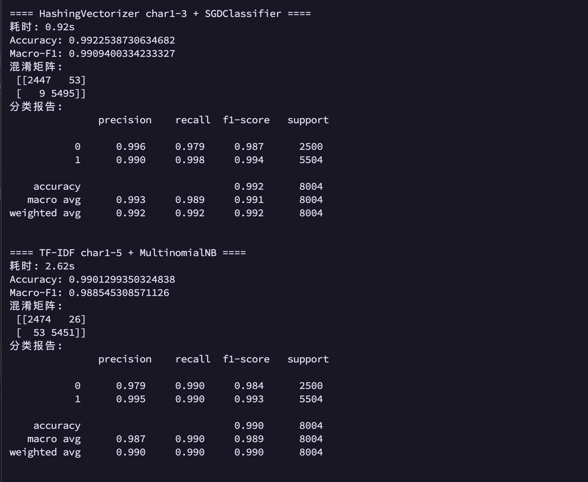


### 5.5 新模型：原始数据集 `big_dataset.txt` mode1: 55划分
```bash
(pytorch_lstm) jiangzhenglan@server-3:~/env/pytorch_lstm/BDPT/2025_Junk_text_Detection$ python multi_main.py
Skipping invalid line: '0'
Skipping invalid line: '0'
Tokenizing: 100%|███████████████████████████████████████████████████████| 799998/799998 [00:02<00:00, 298737.21it/s]

==== TF-IDF char1-3 + LinearSVC ====
耗时: 29.07s
Accuracy: 0.9941249853124633
Macro-F1: 0.9835955506122749
混淆矩阵:
 [[359057    942]
 [  1408  38592]]
分类报告:
               precision    recall  f1-score   support

           0      0.996     0.997     0.997    359999
           1      0.976     0.965     0.970     40000

    accuracy                          0.994    399999
   macro avg      0.986     0.981     0.984    399999
weighted avg      0.994     0.994     0.994    399999


==== TF-IDF char1-3 + LogisticRegression ====
耗时: 41.02s
Accuracy: 0.9895674739186848
Macro-F1: 0.9704368173681224
混淆矩阵:
 [[358799   1200]
 [  2973  37027]]
分类报告:
               precision    recall  f1-score   support

           0      0.992     0.997     0.994    359999
           1      0.969     0.926     0.947     40000

    accuracy                          0.990    399999
   macro avg      0.980     0.961     0.970    399999
weighted avg      0.989     0.990     0.989    399999


==== HashingVectorizer char1-3 + SGDClassifier ====
耗时: 13.90s
Accuracy: 0.9810024525061313
Macro-F1: 0.9429387305686816
混淆矩阵:
 [[359548    451]
 [  7148  32852]]
分类报告:
               precision    recall  f1-score   support

           0      0.981     0.999     0.990    359999
           1      0.986     0.821     0.896     40000

    accuracy                          0.981    399999
   macro avg      0.983     0.910     0.943    399999
weighted avg      0.981     0.981     0.980    399999


==== TF-IDF char1-5 + MultinomialNB ====
耗时: 49.52s
Accuracy: 0.9693599233998085
Macro-F1: 0.9023823363632989
混淆矩阵:
 [[359536    463]
 [ 11793  28207]]
分类报告:
               precision    recall  f1-score   support

           0      0.968     0.999     0.983    359999
           1      0.984     0.705     0.822     40000

    accuracy                          0.969    399999
   macro avg      0.976     0.852     0.902    399999
weighted avg      0.970     0.969     0.967    399999


==== Word2Vec-avg + LogisticRegression ====
耗时: 98.85s
Accuracy: 0.9471173677934195
Macro-F1: 0.8403734833749077
混淆矩阵:
 [[352972   7027]
 [ 14126  25874]]
分类报告:
               precision    recall  f1-score   support

           0      0.962     0.980     0.971    359999
           1      0.786     0.647     0.710     40000

    accuracy                          0.947    399999
   macro avg      0.874     0.814     0.840    399999
weighted avg      0.944     0.947     0.945    399999
```

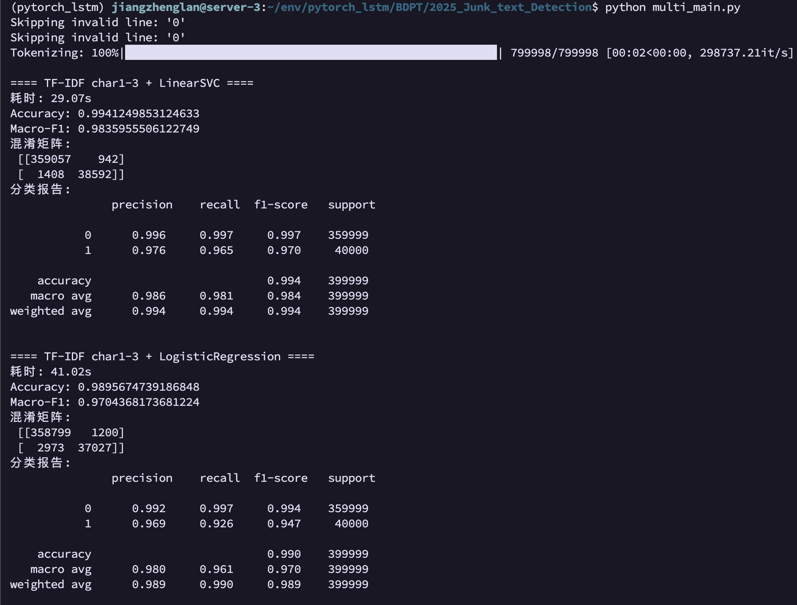
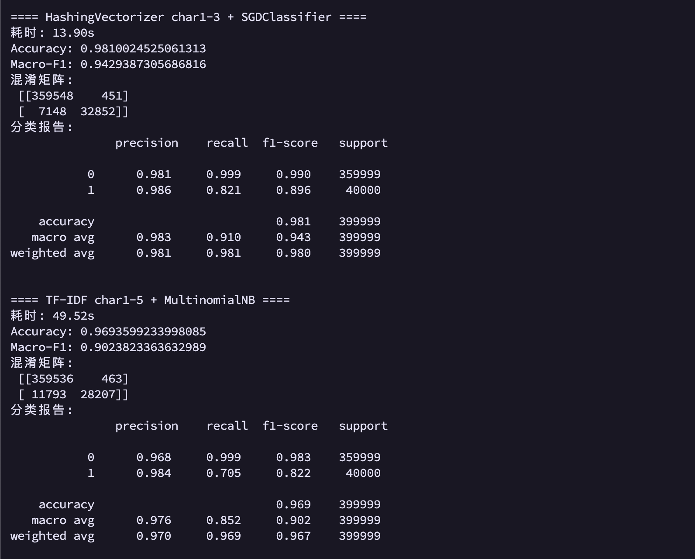
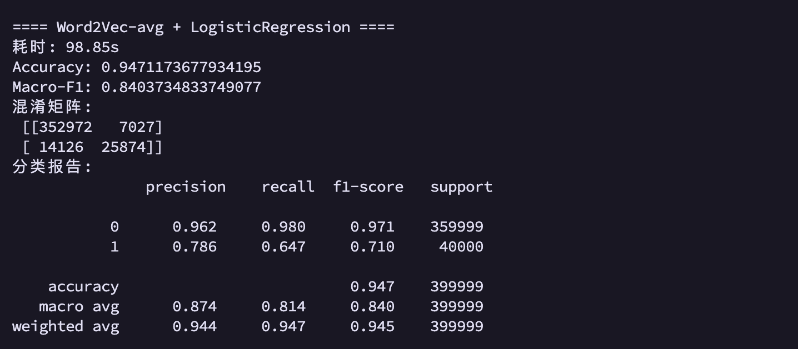


### 5.6 新模型：mode2: `big_dataset.txt`训练，`dataset.txt`测试
```bash
(pytorch_lstm) jiangzhenglan@server-3:~/env/pytorch_lstm/BDPT/2025_Junk_text_Detection$ python multi_main.py
Skipping invalid line: '0'
Skipping invalid line: '0'
Tokenizing: 100%|███████████████████████████████████████████████████████| 799998/799998 [00:02<00:00, 303513.33it/s]
Tokenizing: 100%|██████████████████████████████████████████████████████████| 16007/16007 [00:00<00:00, 77882.41it/s]

==== TF-IDF char1-3 + LinearSVC ====
耗时: 39.24s
Accuracy: 0.6613981383144875
Macro-F1: 0.6566467346075857
混淆矩阵:
 [[4352  648]
 [4772 6235]]
分类报告:
               precision    recall  f1-score   support

           0      0.477     0.870     0.616      5000
           1      0.906     0.566     0.697     11007

    accuracy                          0.661     16007
   macro avg      0.691     0.718     0.657     16007
weighted avg      0.772     0.661     0.672     16007


==== TF-IDF char1-3 + LogisticRegression ====
耗时: 48.11s
Accuracy: 0.5824951583682139
Macro-F1: 0.5823344390531933
混淆矩阵:
 [[4505  495]
 [6188 4819]]
分类报告:
               precision    recall  f1-score   support

           0      0.421     0.901     0.574      5000
           1      0.907     0.438     0.591     11007

    accuracy                          0.582     16007
   macro avg      0.664     0.669     0.582     16007
weighted avg      0.755     0.582     0.585     16007


==== HashingVectorizer char1-3 + SGDClassifier ====
耗时: 15.52s
Accuracy: 0.41344411819828825
Macro-F1: 0.39398969248317406
混淆矩阵:
 [[4743  257]
 [9132 1875]]
分类报告:
               precision    recall  f1-score   support

           0      0.342     0.949     0.503      5000
           1      0.879     0.170     0.285     11007

    accuracy                          0.413     16007
   macro avg      0.611     0.559     0.394     16007
weighted avg      0.712     0.413     0.353     16007


==== TF-IDF char1-5 + MultinomialNB ====
耗时: 68.47s
Accuracy: 0.38258262010370464
Macro-F1: 0.34412628691131386
混淆矩阵:
 [[5000    0]
 [9883 1124]]
分类报告:
               precision    recall  f1-score   support

           0      0.336     1.000     0.503      5000
           1      1.000     0.102     0.185     11007

    accuracy                          0.383     16007
   macro avg      0.668     0.551     0.344     16007
weighted avg      0.793     0.383     0.285     16007


==== Word2Vec-avg + LogisticRegression ====
耗时: 169.56s
Accuracy: 0.4280002498906728
Macro-F1: 0.40509343290781413
混淆矩阵:
 [[4996    4]
 [9152 1855]]
分类报告:
               precision    recall  f1-score   support

           0      0.353     0.999     0.522      5000
           1      0.998     0.169     0.288     11007

    accuracy                          0.428     16007
   macro avg      0.675     0.584     0.405     16007
weighted avg      0.796     0.428     0.361     16007
```

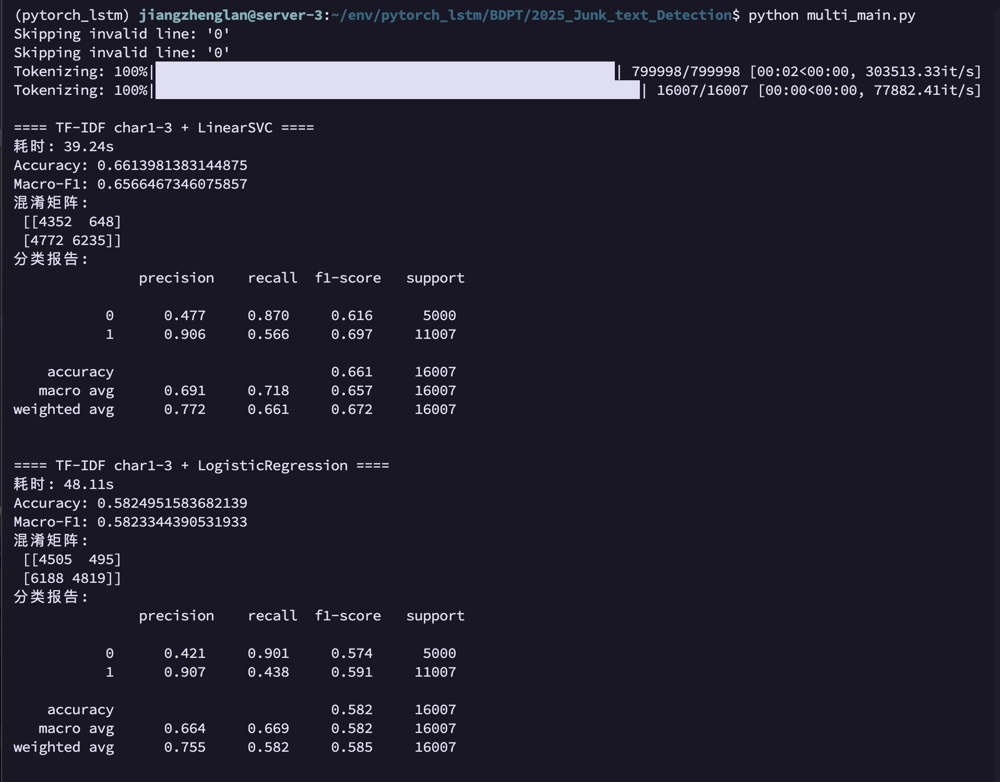
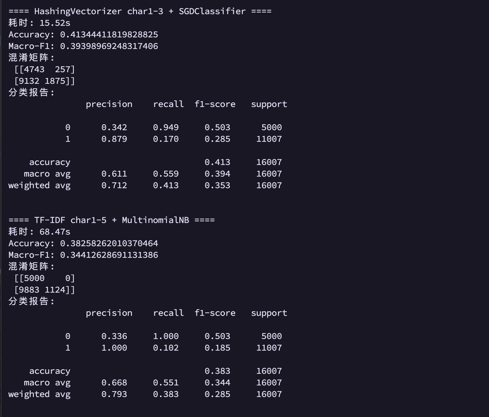
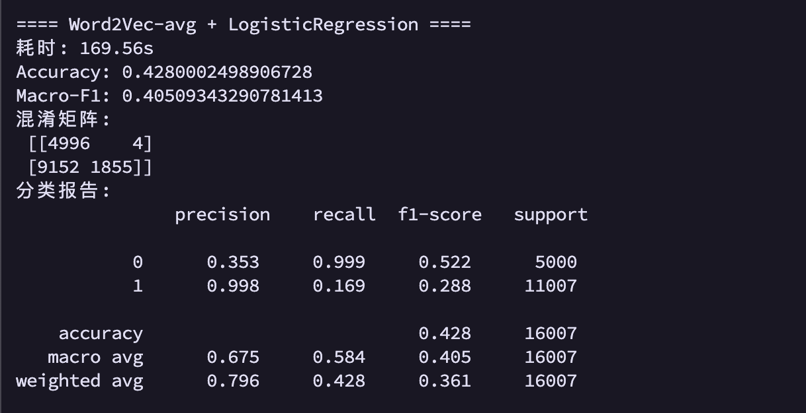

### 5.7 对比图`plot_results_compare.py`
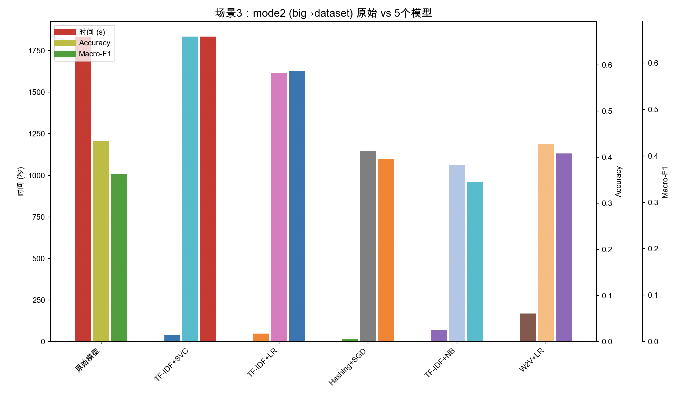
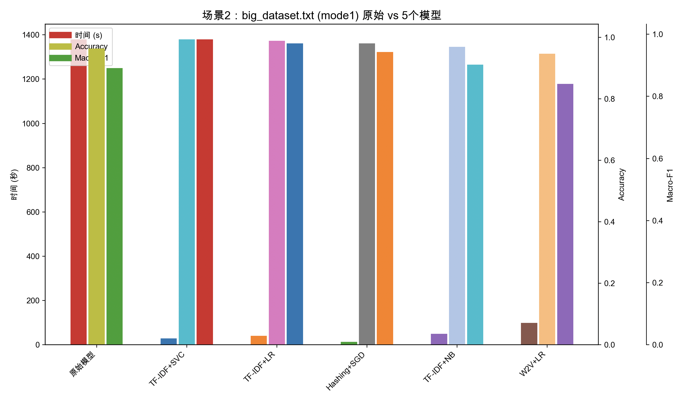
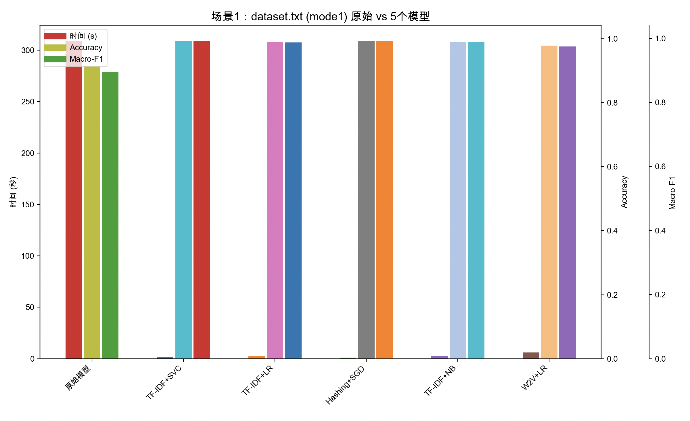