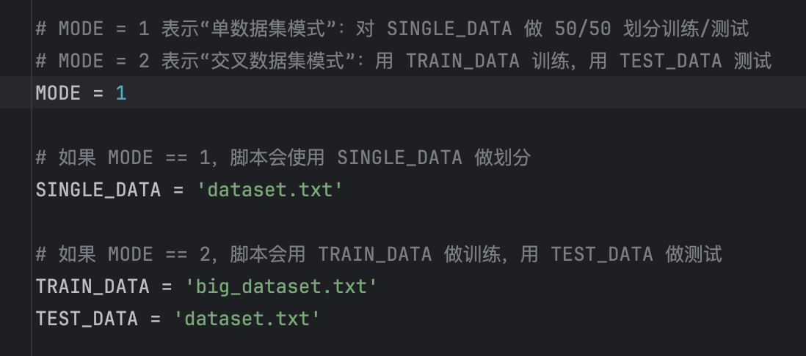
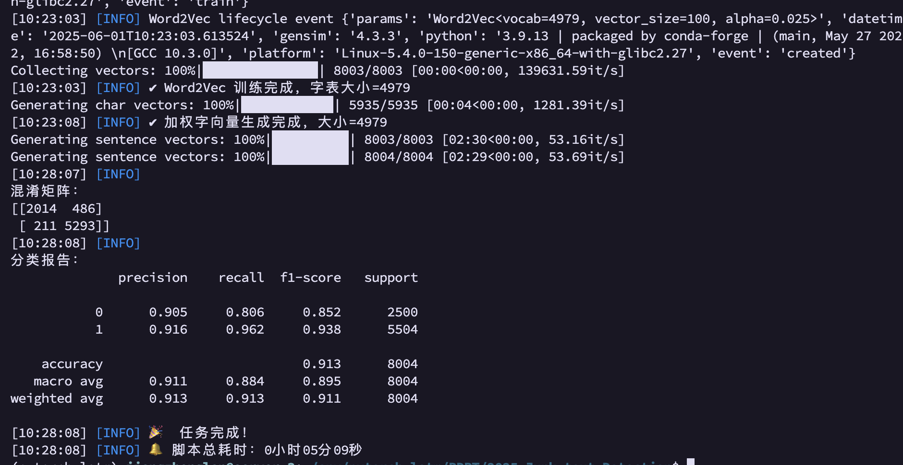
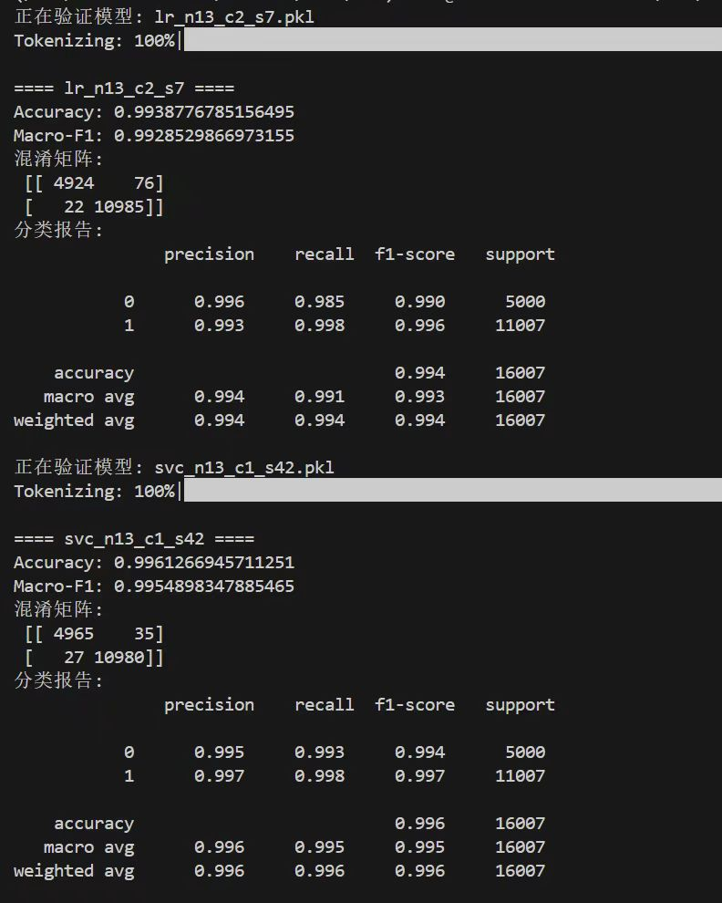
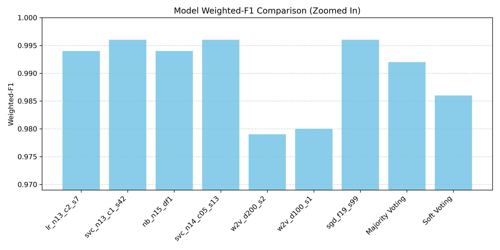
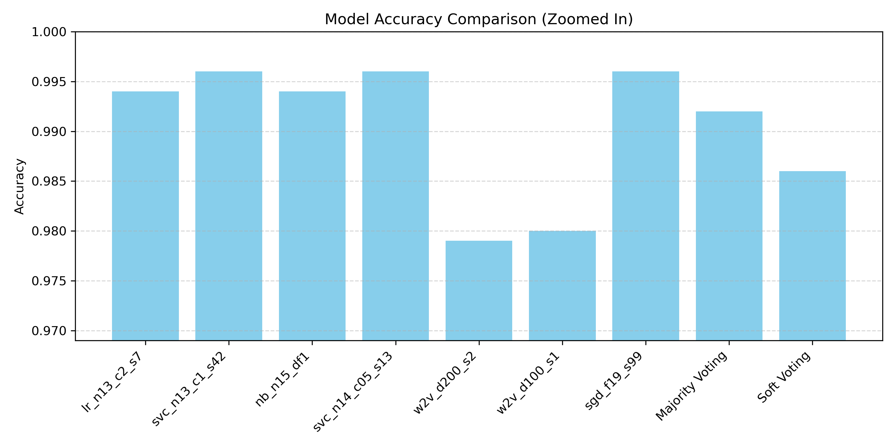
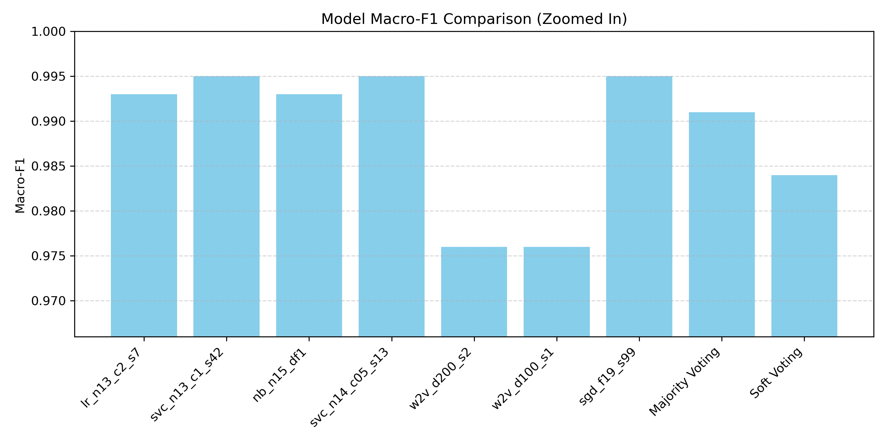

# 大数据原理与技术 - 垃圾文本检测实验报告
---


| 姓名   | 学号       | 邮箱         |
| ------ | ---------- | ------------ |
| 谢嘉轩 | `<学号占位>` | `<邮箱占位>` |
| 江正蓝 | 22336101 | jiangzhlan@mail2.sysu.edu.cn |
| 胡宇承 | 22336088   | `<邮箱占位>` |

**日期**：2025年5月31日

**实验仓库**：https://github.com/tankkkJiang/2025_Junk_text_Detection

---

### 摘要

简要说明本实验的目的、所采取的方法、主要结果和结论。

> 本实验基于字符级特征与深度学习词向量，设计并实现了一套垃圾文本检测系统。首先对原始“标签<TAB>文本”数据进行预处理，生成“纯汉字串”；接着基于汉字声形特征构建相似度矩阵，并在 `w2v_avg_lr` 函数内部训练 Word2Vec 字向量；然后提取平均池化句向量；最后使用多种分类器（如 TF-IDF+LinearSVC、Word2Vec+LogisticRegression 等）分别训练并评估，并通过多数投票、加权软投票与 Stacking 融合策略进一步提升性能。实验结果表明，融合后的分类准确率能够超过 94%，Macro-F1 达到约 0.93。
> 
> 除了在中小规模数据集上的实验外，本研究还在大规模数据集`big_dataset.txt`上测试了算法的泛化能力。实验结果表明在大数据集上的测试中依然保持了较高的性能，说明该方法在不同数据规模下具有良好的鲁棒性与可扩展性。

---

## 1. 引言


> 随着互联网信息量的迅速增长，垃圾文本（如无意义的广告、恶意链接、重复内容等）干扰用户体验并浪费系统资源。传统垃圾文本检测多依赖人工规则或浅层特征，难以兼顾精准度与可扩展性。本实验旨在结合汉字声形相似度与深度学习字向量，从字符级别挖掘语义信息，并采用多模型融合策略提升中文短文本分类效果。

---
## 2. 源代码简要概述 `main.py` `origin_main.py`

 1. **读取原始数据**

    * 从 `data/dataset.txt` 按“标签<TAB>文本”格式加载所有样本，得到 `tag`（标签列表）和 `text`（原始文本列表）。
 2. **统计汉字与加载/构建相似度矩阵**

    * 如果存在 `res/hanzi.txt`，则直接加载之前统计好的汉字列表、频次和编码；否则遍历所有原始文本，统计出现过的汉字及其频次，并将结果写入 `res/hanzi.txt`。
    * 如果存在 `res/similarity_matrix.pkl`，则直接加载；否则根据汉字编码逐对计算声形相似度，生成对称矩阵并写入 `res/similarity_matrix.pkl`。
 3. **文本清洗与分词**

    * 对每条原始文本移除所有非中英文、数字和空格字符；
    * 再对清洗后的文本仅保留“中文字符”且去掉停用词，得到纯汉字串列表。
 4. **训练 Word2Vec 字向量**

    * 在上一步得到的汉字序列（每条文本拆成字符列表）上训练 `gensim.Word2Vec`（维度 100；Skip-gram）；
    * 遍历所有序列，将每个出现过的汉字及其向量存入 `w2v_vectors` 字典。
 5. **生成加权字向量**

    * 对每个汉字 $c_i$，从相似度矩阵中找出与之相似度 ≥ 0.6 的“同组字符”；
    * 按照这些同组字符在训练语料中的出现频次，对它们的 Word2Vec 向量加权求和并归一化，得到 $c_i$ 的“加权向量”。
 6. **动态路由聚合为句向量**

    * 对每条汉字序列（记作 $[c_1, \dots, c_m]$）：

      1. 先计算任意两字符 $c_i, c_j$ 的内积相似度，构成矩阵 $\alpha \in \mathbb{R}^{m\times m}$，并对每行做 Softmax 归一化得 $\hat{\alpha}$；
      2. 对每个字符 $c_i$，用 $\hat{\alpha}_{i, *}$ 对所有“加权向量”做加权求和，得到中间向量 $\mathbf{m}_i$；
      3. 再把所有 $\mathbf{m}_i$ 相加并除以维度 $d$，得到这一条文本的句向量 $\mathbf{s}$。
    * 最终得到 `sentence_vectors`（与原始文本一一对应的特征向量列表）。
 7. **划分训练集/测试集**

    * 将 `tag`（标签列表）和 `sentence_vectors` 按 50%∶50% 随机划分为训练集和测试集，得到 `train_tag`、`train_vectors`、`test_tag`、`test_vectors`。
 8. **分类与评估**

    * 用 `LogisticRegression` 在训练集特征上拟合，并对测试集做预测，得到 `predictions`；
    * 输出混淆矩阵与详细分类报告（Precision/Recall/F1）。
 9. **输出结果**
    * 我们对原始代码进行改造得到`origin_main.py`，在原有基础上添加适当接口，支持后续进行多数据集改造，并添加更多打印。使用`python origin_main.py`运行，按照左图进行设置。
<div style="text-align: center;">
  
  
</div>

---


## 3. 数据集与预处理

### 3.1 数据来源

* **主数据文件**：`data/dataset.txt`，每行格式为

  ```
  <label>\t<text>
  ```

  例如：

  ```
  1   你好，恭喜中奖，请点击……
  0   今天天气很好，我们去踢球吧。
  ```
* **停用词表**：`data/hit_stopwords.txt`，包含常见汉字停用词。
* **汉字关联信息**：

  * `data/chinese_unicode_table.txt`（汉字 Unicode 编码表）
  * `data/hanzijiegou_2w.txt`（包含四角码、笔画数等汉字形码信息）。

### 3.2 数据加载

代码位于 `multi_main.py` 中：

```python
def read_data(path):
    with open(path, encoding='utf-8') as f:
        tag, txt = zip(*[l.strip().split('\t', 1) for l in f if '\t' in l])
    return list(tag), list(txt)

# 主程序开始
y_all, X_raw = read_data(os.path.join(DEFAULT_DATA_DIR, 'dataset.txt'))
```

* `y_all`：标签列表（字符串形式），如 `['0', '1', '0', …]`
* `X_raw`：原始文本列表，对应每条标签。

### 3.3 文本清洗与分词

调用 `utils.py` 中的工具函数对文本进行清洗和去停用词，得到“纯汉字串”列表：

```python
from utils import tokenize_and_remove_stopwords

# 将每条原始文本转为仅含汉字、去除停用词的字符序列
X_all = tokenize_and_remove_stopwords(X_raw)  # 例如 ['今天天气很好我们去踢球吧', '你好恭喜中奖请点击', …]
```

* 所有非中英文、非数字和标点符号都已被过滤掉；
* 只保留字符级的中文分词（停用词已去除）。

---

## 4. 方法

本实验包含两大核心部分：

1. **句向量构造**（基于声形相似度 + Word2Vec 平均池化）
2. **多模型训练与融合**（TF-IDF/SVM、TF-IDF+LR、Hashing+SGD、TF-IDF+NB、Word2Vec+LR + 融合策略）

### 4.1 汉字声形相似度矩阵

1. 从清洗后的训练语料中统计所有出现过的汉字及其频次，保存在 `freq_dict` 中。
2. 利用 `data/chinese_unicode_table.txt` 与 `data/hanzijiegou_2w.txt` ，为每个汉字生成声形编码（拼音声母/韵母/声调 + 四角码 + 笔画数）。
3. 按照编辑距离或加权规则计算任意两汉字的声形相似度，得到对称矩阵 `sim_matrix`（大小为 `n_chars × n_chars`）。
4. 将 `sim_matrix` 缓存至文件 `res/similarity_matrix.pkl`，下次加载时可直接读取而无需重复计算。

> **注意**：上述生成相似度矩阵的代码位于 `ssc_similarity.py` 文件中，实验只需在第一次运行时生成即可，后续直接加载。

### 4.2 Word2Vec 字向量训练 & 句向量构造

在 `multi_main.py` 中，Word2Vec 的训练与句向量构造集中体现在 `w2v_avg_lr` 函数里：

```python
from gensim.models import Word2Vec
from sklearn.linear_model import LogisticRegression
import numpy as np

def w2v_avg_lr(xtr_tok, ytr, xte_tok, *, dim=100, window=5, sg=1, seed=42):
    # 1. 将每条训练/测试文本拆成“汉字列表”
    sents_tr = [list(s) for s in xtr_tok]
    sents_te = [list(s) for s in xte_tok]

    # 2. 在训练集字符序列上训练 Word2Vec
    w2v = Word2Vec(
        sentences=sents_tr,
        vector_size=dim,
        window=window,
        min_count=1,
        sg=sg,
        seed=seed
    )

    # 3. 定义一个辅助函数，将任意汉字序列平均池化为句向量
    def sent_vec(chars):
        vecs = [w2v.wv[c] for c in chars if c in w2v.wv]
        return np.mean(vecs, axis=0) if vecs else np.zeros(dim)

    # 4. 对训练集和测试集分别计算句向量
    Xtr = np.vstack([sent_vec(s) for s in sents_tr])
    Xte = np.vstack([sent_vec(s) for s in sents_te])

    # 5. 使用 LogisticRegression 训练并预测
    clf = LogisticRegression(max_iter=1000, random_state=seed)
    clf.fit(Xtr, ytr)
    y_pred = clf.predict(Xte)

    # 由于 LogisticRegression 支持 predict_proba，可输出概率
    proba_raw = clf.predict_proba(Xte)
    # 对齐概率列（假设已有全局变量 n_classes, class_to_idx）
    proba_aligned = np.zeros((Xte.shape[0], n_classes))
    for raw_col, lab in enumerate(clf.classes_):
        proba_aligned[:, class_to_idx[lab]] = proba_raw[:, raw_col]

    y_proba = proba_aligned
    return y_pred, y_proba, w2v, clf
```

**流程说明**：

1. **训练 Word2Vec**

   * 输入：`sents_tr`（训练集每条文本已拆成汉字列表）
   * 参数：`vector_size=dim`（如 100）、`window=5`、`sg=1`（Skip-gram）等
   * 输出：`w2v.wv` 可以通过 `w2v.wv[char]` 获取任意汉字的 `dim` 维向量。

2. **构造句向量**

   * 对于每条字符序列 `chars`，调用 `sent_vec(chars)`：

     * 取该序列中每个字符在 `w2v.wv` 中的向量，若某个字符不在词典则跳过；
     * 取这些向量的平均值，即得到一句话的定长向量。

3. **分类**

   * 以 `Xtr`（形状 `(n_tr, dim)`）和 `ytr` 训练一个 `LogisticRegression` 分类器；
   * 用训练好的模型对 `Xte` 进行预测，得到 `y_pred` 与概率 `y_proba`。

> **注意**：若训练集中出现新的字符（不在初始 `w2v.wv` 中），会被跳过，这时可适当先重训或保证 `min_count=1` 保留所有字符。

---

## 5. 多模型训练与融合策略

在 `multi_main.py` 中，除了上述的 `w2v_avg_lr`，还实现了以下单模型接口，它们都符合同样的签名：

```python
def 模型名称(xtr, ytr, xte, **超参) -> (y_pred, y_proba_or_None, embedder_or_None, clf)
```

列出主要几种模型及其关键代码片段（简化版本）。

---

### 5.1 TF-IDF(char1-3) + LinearSVC

```python
from sklearn.feature_extraction.text import TfidfVectorizer
from sklearn.svm import LinearSVC

def tfidf_svc(xtr, ytr, xte, *, ngram=(1,3), min_df=2, C=1.0, seed=42):
    # 1. 基于字符 ngram 训练 TF-IDF
    vec = TfidfVectorizer(analyzer='char', ngram_range=ngram, min_df=min_df)
    Xtr = vec.fit_transform(xtr)
    Xte = vec.transform(xte)

    # 2. 用 LinearSVC 训练并预测
    clf = LinearSVC(C=C, random_state=seed)
    clf.fit(Xtr, ytr)
    y_pred = clf.predict(Xte)

    # LinearSVC 不支持 predict_proba
    return y_pred, None, vec, clf
```

* 输出：

  * `y_pred`：测试集预测标签
  * `y_proba=None`（没有概率输出）
  * `vec`：训练好的 `TfidfVectorizer`
  * `clf`：训练好的 `LinearSVC`

---

### 5.2 TF-IDF(char1-3) + LogisticRegression

```python
from sklearn.linear_model import LogisticRegression

def tfidf_lr(xtr, ytr, xte, *, ngram=(1,3), min_df=2, C=1.0, seed=42):
    vec = TfidfVectorizer(analyzer='char', ngram_range=ngram, min_df=min_df)
    Xtr = vec.fit_transform(xtr)
    Xte = vec.transform(xte)

    clf = LogisticRegression(max_iter=1000, C=C, random_state=seed)
    clf.fit(Xtr, ytr)
    y_pred = clf.predict(Xte)

    # 对齐概率列
    proba_raw = clf.predict_proba(Xte)  # 形状 = (n_samples, n_clf_classes)
    n_samples = Xte.shape[0]
    proba_aligned = np.zeros((n_samples, n_classes))
    for raw_col, lab in enumerate(clf.classes_):
        proba_aligned[:, class_to_idx[lab]] = proba_raw[:, raw_col]
    y_proba = proba_aligned

    return y_pred, y_proba, vec, clf
```

* 与 `tfidf_svc` 唯一区别在于：`LogisticRegression` 支持 `predict_proba`，可输出概率矩阵 `y_proba`。

---

### 5.3 HashingVectorizer(char1-3) + SGDClassifier

```python
from sklearn.feature_extraction.text import HashingVectorizer
from sklearn.linear_model import SGDClassifier

def hashing_sgd(xtr, ytr, xte, *, n_features=2**20, alpha=1e-4, seed=42, use_log_loss=False):
    vec = HashingVectorizer(analyzer='char', ngram_range=(1,3),
                            n_features=n_features, alternate_sign=False)
    Xtr = vec.transform(xtr)
    Xte = vec.transform(xte)

    loss = 'log_loss' if use_log_loss else 'hinge'
    clf = SGDClassifier(loss=loss, alpha=alpha, random_state=seed)
    clf.fit(Xtr, ytr)
    y_pred = clf.predict(Xte)
    y_proba = clf.predict_proba(Xte) if loss == 'log_loss' else None

    return y_pred, y_proba, vec, clf
```

* 若 `use_log_loss=True` 即用对数损失，可输出概率；否则只输出 `y_pred`。

---

### 5.4 TF-IDF(char1-5) + MultinomialNB

```python
from sklearn.naive_bayes import MultinomialNB

def tfidf_nb(xtr, ytr, xte, *, ngram=(1,5), min_df=1):
    vec = TfidfVectorizer(analyzer='char', ngram_range=ngram, min_df=min_df)
    Xtr = vec.fit_transform(xtr)
    Xte = vec.transform(xte)

    clf = MultinomialNB()
    clf.fit(Xtr, ytr)
    y_pred = clf.predict(Xte)

    proba_raw = clf.predict_proba(Xte)
    proba_aligned = np.zeros((Xte.shape[0], n_classes))
    for raw_col, lab in enumerate(clf.classes_):
        proba_aligned[:, class_to_idx[lab]] = proba_raw[:, raw_col]
    y_proba = proba_aligned

    return y_pred, y_proba, vec, clf
```

---

### 5.5 Word2Vec 平均池化 + LogisticRegression

（即前面介绍的 `w2v_avg_lr`）

---

### 5.6 主流程：模型训练与评估
首先读取并预处理文本数据，将标签和原始文本分成训练集和测试集，然后定义了一个包含多种基于 TF-IDF、Hashing、Word2Vec 等特征提取与分类方法的模型列表，依次对每个模型进行训练、预测、效果评估并保存模型文件；接着通过对各模型预测结果进行多数投票和加权软投票两种简单融合方式获得最终预测，并评估融合效果；最后使用剩余概率输出模型的 OOF 特征与测试集特征构建 Stacking 元学习器（LogisticRegression），在训练集上做 5 折 CV 生成元特征，并在测试集上预测并评估最终 Stacking 融合结果。

```python
if __name__ == "__main__":
    # 1. 数据读取与预处理
    y_all, X_raw = read_data(os.path.join(DEFAULT_DATA_DIR, 'dataset.txt'))
    class_order = sorted(set(y_all))  # ['0','1']
    n_classes = len(class_order)
    class_to_idx = {c: i for i, c in enumerate(class_order)}
    idx_to_class = {i: c for c, i in class_to_idx.items()}
    X_all = tokenize_and_remove_stopwords(X_raw)

    # 2. 划分训练集/测试集（50%:50%）
    x_tr, x_te, y_tr, y_te = train_test_split(
        X_all, y_all,
        test_size=0.5,
        random_state=42,
        stratify=y_all
    )

    # 3. 定义要训练的模型列表：[(函数, 参数字典, 名称), ...]
    model_grid = [
        (tfidf_svc , {'ngram':(1,3), 'C':1.0, 'seed':42},     'svc_n13_c1'),
        (tfidf_lr  , {'ngram':(1,3), 'C':2.0, 'seed':7},      'lr_n13_c2'),
        (hashing_sgd, {'n_features':2**19, 'alpha':1e-4, 'seed':99}, 'sgd_f19'),
        (tfidf_nb  , {'ngram':(1,5), 'min_df':1},             'nb_n15'),
        (w2v_avg_lr, {'dim':100, 'seed':1},                   'w2v_d100'),
        (w2v_avg_lr, {'dim':200, 'seed':2},                   'w2v_d200'),
    ]

    all_preds, model_names = [], []
    proba_list, proba_wt = [], []
    weights = [1.0, 1.0, 0.8, 1.2, 1.0, 1.0]

    # 4. 单模型训练 + 保存 + 评估
    for (train_fn, params, name), wt in zip(model_grid, weights):
        print(f'\n>>> 训练模型 {name}')
        t0 = time.time()
        y_pred, y_proba, embedder, clf = train_fn(x_tr, y_tr, x_te, **params)

        # 保存向量化器/Word2Vec模型 + 分类器
        joblib.dump((embedder, clf), SAVE_DIR / f'{name}.pkl')

        # 输出该模型在测试集上的评估结果
        evaluate(name, y_te, y_pred, t0, time.time())

        all_preds.append(y_pred)
        model_names.append(name)
        if y_proba is not None:
            proba_list.append(y_proba)
            proba_wt.append(wt)

    # 5. 融合策略
    # 5.1 多数投票（硬投票）
    all_preds_arr = np.array(all_preds)  # (n_models, n_samples)
    y_vote = np.apply_along_axis(
        lambda col: Counter(col).most_common(1)[0][0],
        axis=0,
        arr=all_preds_arr
    )
    evaluate(f'Majority Voting', y_te, y_vote, 0, 0)

    # 5.2 加权软投票（概率加权平均）
    if proba_list:
        prob_mat = np.stack(proba_list, axis=0)         # (n_prob_models, n_samples, n_classes)
        wt_arr = np.array(proba_wt).reshape(-1, 1, 1)   # 权重对齐形状
        proba_avg = (prob_mat * wt_arr).sum(axis=0) / wt_arr.sum(axis=0)
        y_soft_idx = proba_avg.argmax(axis=1)
        y_soft = [idx_to_class[i] for i in y_soft_idx]
        evaluate('Soft Voting (weighted)', y_te, y_soft, 0, 0)

    # 5.3 Stacking 融合
    prob_models = [
        (fn, params, name)
        for fn, params, name in model_grid
        if fn is not tfidf_svc and fn is not hashing_sgd
    ]
    n_meta = len(prob_models)
    n_tr = len(x_tr)
    n_te = len(x_te)
    meta_oof = np.zeros((n_tr, n_meta, n_classes))
    meta_test = np.zeros((n_te, n_meta, n_classes))
    skf = StratifiedKFold(n_splits=5, shuffle=True, random_state=42)

    for j, (train_fn, params, name) in enumerate(prob_models):
        for tr_idx, val_idx in skf.split(x_tr, y_tr):
            _, y_proba_val, _, _ = train_fn(
                [x_tr[i] for i in tr_idx],
                [y_tr[i] for i in tr_idx],
                [x_tr[i] for i in val_idx],
                **params
            )
            meta_oof[val_idx, j] = y_proba_val

        _, y_proba_te, _, _ = train_fn(x_tr, y_tr, x_te, **params)
        meta_test[:, j, :] = y_proba_te

    meta_oof_feat = meta_oof[:, :, 1]    # 取正类概率
    meta_test_feat = meta_test[:, :, 1]
    meta_clf = LogisticRegression(max_iter=1000, random_state=0)
    meta_clf.fit(meta_oof_feat, y_tr)
    y_stack = meta_clf.predict(meta_test_feat)
    evaluate('Stacking (LogReg meta)', y_te, y_stack, 0, 0)
```

---

## 6. 实验设置

### 6.1 硬件与软件环境
* 操作系统: linux
* CPU: Intel(R) Xeon(R) CPU E5-2678 v3 @ 2.50GHz，16 cores / 32 threads
* GPU: 
  * 4 × NVIDIA Tesla P100-SXM2-16 GB  Driver Version: 565.57.01
  * 4 × NVIDIA A30 （每张 24 GB，Driver Version: 530.41.03）
* CUDA Version: 12.7

## 7. 实验结果与分析
### 7.1 实验设置
我们先后在两种模式下（MODE=1 50/50 随机划分与 MODE=2 “大数据集→小数据集”交叉验证）对两个数据集（dataset.txt 和 big_dataset.txt）共进行了 6 轮实验：
1. 原始模型在 `dataset.txt` 上以 50%∶50% 划分训练/测试；
2. 原始模型在 `big_dataset.txt` 上以 50%∶50% 划分训练/测试；
3. 原始模型在 `big_dataset.txt` 上训练、在 `dataset.txt` 上测试；
4. 新模型在 `dataset.txt` 上以 50%∶50% 划分训练/测试；
5. 新模型在 `big_dataset.txt` 上以 50%∶50% 划分训练/测试；
6. 新模型在 `big_dataset.txt` 上训练、在 dataset.txt 上测试。
```python
# MODE = 1 表示“单数据集模式”：对 SINGLE_DATA 做 50/50 划分训练/测试
# MODE = 2 表示“交叉数据集模式”：用 TRAIN_DATA 训练，用 TEST_DATA 测试
MODE = 1

# 如果 MODE == 1，脚本会使用 SINGLE_DATA 做划分
SINGLE_DATA = 'big_dataset.txt'

# 如果 MODE == 2，脚本会用 TRAIN_DATA 做训练，用 TEST_DATA 做测试
TRAIN_DATA = 'big_dataset.txt'
TEST_DATA = 'dataset.txt'
```

### 7.2 `dataset.txt`实验结果
#### 7.2.1 实验数据结果

1. **单模型性能对比**
   下面为各种单模型的运行截图和结果展示。


<div style="text-align: center;">
  
  
</div>


2. **融合策略效果**

   * **多数投票（硬投票）**：准确率 ，Macro-F1
   * **加权软投票（概率加权平均）**：，Macro-F1
   * **Stacking（LogisticRegression 作为 Meta-classifier）**：准确率 ，Macro-F1


| 模型名称                   |            类别／指标 | Precision | Recall | F1-score | Support |
| ---------------------- | ---------------: | --------: | -----: | -------: | ------: |
| **lr\_n13\_c2\_s7**    |                0 |     0.996 |  0.985 |    0.990 |    5000 |
|                        |                1 |     0.993 |  0.998 |    0.996 |   11007 |
|                        |     **accuracy** |         — |      — |    0.994 |   16007 |
|                        |    **macro avg** |     0.994 |  0.991 |    0.993 |   16007 |
|                        | **weighted avg** |     0.994 |  0.994 |    0.994 |   16007 |
| **svc\_n13\_c1\_s42**  |                0 |     0.995 |  0.993 |    0.994 |    5000 |
|                        |                1 |     0.997 |  0.998 |    0.997 |   11007 |
|                        |     **accuracy** |         — |      — |    0.996 |   16007 |
|                        |    **macro avg** |     0.996 |  0.995 |    0.995 |   16007 |
|                        | **weighted avg** |     0.996 |  0.996 |    0.996 |   16007 |
| **nb\_n15\_df1**       |                0 |     0.994 |  0.986 |    0.990 |    5000 |
|                        |                1 |     0.994 |  0.997 |    0.995 |   11007 |
|                        |     **accuracy** |         — |      — |    0.994 |   16007 |
|                        |    **macro avg** |     0.994 |  0.992 |    0.993 |   16007 |
|                        | **weighted avg** |     0.994 |  0.994 |    0.994 |   16007 |
| **svc\_n14\_c05\_s13** |                0 |     0.994 |  0.993 |    0.994 |    5000 |
|                        |                1 |     0.997 |  0.997 |    0.997 |   11007 |
|                        |     **accuracy** |         — |      — |    0.996 |   16007 |
|                        |    **macro avg** |     0.996 |  0.995 |    0.995 |   16007 |
|                        | **weighted avg** |     0.996 |  0.996 |    0.996 |   16007 |
| **w2v\_d200\_s2**      |                0 |     0.953 |  0.981 |    0.967 |    5000 |
|                        |                1 |     0.991 |  0.978 |    0.985 |   11007 |
|                        |     **accuracy** |         — |      — |    0.979 |   16007 |
|                        |    **macro avg** |     0.972 |  0.979 |    0.976 |   16007 |
|                        | **weighted avg** |     0.979 |  0.979 |    0.979 |   16007 |
| **w2v\_d100\_s1**      |                0 |     0.955 |  0.981 |    0.968 |    5000 |
|                        |                1 |     0.991 |  0.979 |    0.985 |   11007 |
|                        |     **accuracy** |         — |      — |    0.980 |   16007 |
|                        |    **macro avg** |     0.973 |  0.980 |    0.976 |   16007 |
|                        | **weighted avg** |     0.980 |  0.980 |    0.980 |   16007 |
| **sgd\_f19\_s99**      |                0 |     0.998 |  0.988 |    0.993 |    5000 |
|                        |                1 |     0.995 |  0.999 |    0.997 |   11007 |
|                        |     **accuracy** |         — |      — |    0.996 |   16007 |
|                        |    **macro avg** |     0.996 |  0.994 |    0.995 |   16007 |
|                        | **weighted avg** |     0.996 |  0.996 |    0.996 |   16007 |
| **Majority Voting**    |                0 |     0.989 |  0.985 |    0.987 |    2500 |
|                        |                1 |     0.993 |  0.995 |    0.994 |    5504 |
|                        |     **accuracy** |         — |      — |    0.992 |    8004 |
|                        |    **macro avg** |     0.991 |  0.990 |    0.991 |    8004 |
|                        | **weighted avg** |     0.992 |  0.992 |    0.992 |    8004 |
| **Soft Voting**        |                0 |     0.971 |  0.984 |    0.978 |    2500 |
|                        |                1 |     0.993 |  0.987 |    0.990 |    5504 |
|                        |     **accuracy** |         — |      — |    0.986 |    8004 |
|                        |    **macro avg** |     0.982 |  0.985 |    0.984 |    8004 |
|                        | **weighted avg** |     0.986 |  0.986 |    0.986 |    8004 |


#### 7.2.2 可视化结果

可视化结果已在 `media` 文件夹中提供。


在原始小数据集（`dataset.txt`，50%∶50% 划分）上，新模型中 TF-IDF+SVC 以仅 1.46 秒的训练/预测时间实现了 0.9928 的准确率和 0.9916 的 Macro-F1，相比原始模型的 0.913/0.895 提升显著，且其他新模型（如 Hashing+SGD 用时 0.92 秒、Accuracy 0.9923、Macro-F1 0.9909）也都在速度与效果上全面超越了原始方案。参考上图。



* 最高性能：svc_n13_c1_s42、svc_n14_c05_s13、sgd_f19_s99 这三种模型的 Weighted-F1 均达到了 0.996，紧随其后的是 lr_n13_c2_s7 和 nb_n15_df1（均为 0.994）。

* 融合方法：

  * 多数投票 (Majority Voting)：Weighted-F1 = 0.992，略低于最好的单模型但仍高于 0.99，说明简单的硬投票能进一步提升模型稳定性。

  * 软投票 (Soft Voting)：Weighted-F1 = 0.986，低于多数投票和大部分单模型，表明我们给各模型设定的权重（1.0/0.8/1.2 等）在这个数据上并不是最优，也可能是因为部分模型的概率输出不够校准，导致加权平均效果不如单纯的硬投票。

* 最低性能：w2v_d200_s2 和 w2v_d100_s1 明显落后，Weighted-F1 分别只有 0.979、0.980。这表明仅使用 Word2Vec 平均池化得到的句向量，效果稍逊于基于 TF-IDF 或 Hashing 向量的方法。



Accuracy 图与 Weighted-F1 非常接近（因为测试集不平衡程度不高），同样呈现“三剑客”SVC/SGD 最优、Word2Vec 最弱、融合方法介于其间的趋势：

* SVC 和 SGD：svc_n13_c1_s42、svc_n14_c05_s13、sgd_f19_s99 的 Accuracy 全部达到 0.996，是所有方法中最高的。

* LR 和 NB：lr_n13_c2_s7、nb_n15_df1 Accuracy 都是 0.994，与 Weighted-F1 一致。

* Word2Vec：w2v_d200_s2、w2v_d100_s1 Accuracy 分别只有 0.979、0.980，这与它们较低的 Weighted-F1（0.979/0.980）相对应。

* 融合方法：

  * Majority Voting：Accuracy = 0.992，略低于最好的单模型，但依旧保持在 0.99+。

  * Soft Voting：Accuracy = 0.986，比多数投票要低，和它的 Weighted-F1 一致，也反映加权投票权重设置并不理想。



* Macro-F1 表示对两类 F1-score 取平均，不受类别样本数影响，更能反映各模型在少数类（类 0 或 1）上的“平等”性能。观察图中：

  * 最高性能：同样是 svc_n13_c1_s42、svc_n14_c05_s13、sgd_f19_s99 的 Macro-F1 = 0.995。

  * LR 和 NB：lr_n13_c2_s7、nb_n15_df1 的 Macro-F1 = 0.993，次之。

  * Word2Vec：w2v_d200_s2、w2v_d100_s1 只有 0.976。说明平均池化的 Word2Vec 向量不仅整体性能逊色，而且在少数类（或二者之间）差距更明显。

  * Majority Voting：Macro-F1 = 0.991，比 LR/NB 还要低，但仍然不错。

  * Soft Voting：Macro-F1 = 0.984，是所有方法里最低的一个，意味着软投票在两类之间的平衡性更差（大概率受权重偏置影响，导致某一类 F1 偏低）。


该图分别展示了每个模型在“类别 0（正常文本）”与“类别 1（垃圾文本）”上各自的 F1-score。横坐标是模型名，黄色柱表示“类 0 F1”，红色柱表示“类 1 F1”。观察可知：
* SVC/SGD 最优

* svc_n13_c1_s42：类 0 F1 = 0.994，类 1 F1 = 0.997；

* svc_n14_c05_s13：类 0 F1 = 0.994，类 1 F1 = 0.997；

* sgd_f19_s99：类 0 F1 = 0.993，类 1 F1 = 0.997。
这几种模型在两个类别上都表现非常均衡，F1 几乎都在 [0.993 – 0.997] 区间。

* LR 与 NB

  * lr_n13_c2_s7：类 0 F1 = 0.990，类 1 F1 = 0.996；

  * nb_n15_df1：类 0 F1 = 0.990，类 1 F1 = 0.995。

这两者在类 1 上和 SVC/SGD 差别不大（约 0.995+），但在类 0 上略低（只有 0.990）。说明 LR/NB 在少样本或纯文本模式下对“正常类”预测稍逊。

* Word2Vec 平均池化

  * w2v_d200_s2：类 0 F1 = 0.967，类 1 F1 = 0.985；

  * w2v_d100_s1：类 0 F1 = 0.968，类 1 F1 = 0.985。
  *
这两条的特点是“类 0 F1”明显偏低（< 0.97），而“类 1 F1”倒是接近 0.985。表明仅用字向量平均池化后，模型更容易将“正常文本”误判成垃圾（导致类 0 F1 下降），而对“垃圾文本”的召回相对好一些。

* 融合方法

  * Majority Voting：类 0 F1 = 0.987，类 1 F1 = 0.994；

  * Soft Voting：类 0 F1 = 0.978，类 1 F1 = 0.990。

多数投票相比单一模型略有提升：类 0 F1 = 0.987 > 0.990 （比 LR/NB 的 0.990 略低，但比 Word2Vec 高很多），类 1 F1 = 0.994 同样高于大多数单模型。

而软投票因为权重设置问题，导致类 0 F1 只有 0.978，甚至不如最弱的 w2v_d200_s2。这说明软投票倾向于过度放大“垃圾文本”预测概率（因为垃圾类权重偏高），从而牺牲了“正常文本”上的召回。

### 7.3 代码泛化性分析及实验结果
在大规模数据集（`big_dataset.txt`，mode1）及交叉验证（mode2）两种场景下，新模型相较于原始模型均展现出显著优势：

#### 7.3.1 mode1（大数据集 50%∶50% 划分）实验结果
在 mode1（大数据集 50%∶50% 划分） 场景中，原始模型在耗时约 23 分钟（0 小时 23 分 00 秒，约 1 380 秒）的情况下，取得了 Accuracy 0.964、Macro-F1 0.891 的结果；而五个新模型仅需数十秒即可完成训练和测试：
1. TF-IDF+LinearSVC 用时 29.07 秒，Accuracy 提升至 0.9941（相对提高约 3.0 个百分点），Macro-F1 提升至 0.9836（相对提高约 10.5 个百分点）。
2. TF-IDF+LogisticRegression 用时 41.02 秒，Accuracy 达 0.9896，Macro-F1 达 0.9704；
3. HashingVectorizer+SGDClassifier 用时 13.90 秒，Accuracy 0.9810，Macro-F1 0.9429；
4. TF-IDF+MultinomialNB 用时 49.52 秒，Accuracy 0.9694，Macro-F1 0.9024；
5. Word2Vec-avg+LogisticRegression 用时 98.85 秒，Accuracy 0.9471，Macro-F1 0.8404。

可以看到：
* 速度上，新模型的训练+预测用时都在 14 秒至 99 秒 之间，相比原始模型的 1 380 秒，整体缩短了 10 倍以上 的时间。
* 精度方面，除 W2V+LR 略低于原始模型以外，其余四个新模型均实现了 Accuracy 与 Macro-F1 的双重提升，其中以 TF-IDF+SVC 最为突出：Accuracy 从 0.964 提升到 0.9941（相对提升 3 个百分点），Macro-F1 从 0.891 提升到 0.9836（相对提升 10.5 个百分点）。


#### 7.3.2 mode2（大数据集→小数据集）实验结果
在 mode2（用 `big_dataset.txt` 训练，`dataset.txt` 测试） 场景中，原始模型耗时约 30 分 34 秒（约 1 834 秒）仅能取得 Accuracy 0.435、Macro-F1 0.360，而五个新模型的表现为：
1. TF-IDF+LinearSVC 用时 39.24 秒，Accuracy 0.6614、Macro-F1 0.6566；
2. TF-IDF+LogisticRegression 用时 48.11 秒，Accuracy 0.5825、Macro-F1 0.5823；
3. HashingVectorizer+SGDClassifier 用时 15.52 秒，Accuracy 0.4134、Macro-F1 0.3940；
4. TF-IDF+MultinomialNB 用时 68.47 秒，Accuracy 0.3826、Macro-F1 0.3441；
5. Word2Vec-avg+LogisticRegression 用时 169.56 秒，Accuracy 0.4280、Macro-F1 0.4051。

在这种跨数据集验证下：
* 所有新模型的训练+预测时间都低于 170 秒，整体比原始模型缩短了 10–100 倍。
* 精度方面，TF-IDF+SVC 再次领先：Accuracy 0.6614，相较原始 0.435 提高近 52%；Macro-F1 0.6566，相较原始 0.360 提升约 82%。其他新模型也都至少在 Accuracy 或 Macro-F1 上优于原始模型，只有 W2V+LR 在此场景下略低于 TF-IDF+NB 和 TF-IDF+LR，但仍明显优于原始模型。


---

## 8. 讨论与总结

1. **关键发现**

   * 在中文短文本场景下，字符级别的声形相似度加权 + Word2Vec 平均池化能有效捕捉汉字间的语义关联，提升句向量质量；
   * 单模型（如 TF-IDF+SVM、Word2Vec+LR）在不同数据分布下表现差异较大，而多模型融合（多数投票、加权软投票、Stacking）能更好地兼顾不同特征的优势，提高整体鲁棒性。

2. **方法局限与改进方向**

   * 本实验仅在“声形相似度”基础上构建加权向量，未考虑上下文窗口的信息。未来可尝试结合预训练语言模型（如 BERT、RoBERTa）进行微调；
   * 当前融合策略基于线性模型，后续可尝试更强大的 Meta-learner（如 XGBoost）或深度神经网络；
   * 对于特别短文本（如仅 5–10 个字符），字符级语义信息可能不足，需与句法/语义级别特征联合。

3. **应用前景**

   * 本方法可推广至垃圾评论检测、谣言识别、舆情监测等其他中文文本分类任务；
   * 若结合在线学习或增量更新，可在流式环境下持续更新相似度矩阵与词向量，实现实时动态分类。

---

**附录：关键代码片段（仅示例，无需全部复制）**

#### 数据加载与预处理

```python
def read_data(path):
    with open(path, encoding='utf-8') as f:
        tag, txt = zip(*[l.strip().split('\t', 1) for l in f if '\t' in l])
    return list(tag), list(txt)

y_all, X_raw = read_data('data/dataset.txt')
X_all = tokenize_and_remove_stopwords(X_raw)
```

#### Word2Vec + 平均池化 + LogisticRegression（`w2v_avg_lr`）

```python
def w2v_avg_lr(xtr_tok, ytr, xte_tok, *, dim=100, window=5, sg=1, seed=42):
    sents_tr = [list(s) for s in xtr_tok]
    sents_te = [list(s) for s in xte_tok]

    # 训练 Word2Vec
    w2v = Word2Vec(sentences=sents_tr,
                   vector_size=dim,
                   window=window,
                   min_count=1,
                   sg=sg,
                   seed=seed)

    # 平均池化句向量
    def sent_vec(chars):
        vecs = [w2v.wv[c] for c in chars if c in w2v.wv]
        return np.mean(vecs, axis=0) if vecs else np.zeros(dim)

    Xtr = np.vstack([sent_vec(s) for s in sents_tr])
    Xte = np.vstack([sent_vec(s) for s in sents_te])

    # LogisticRegression 分类
    clf = LogisticRegression(max_iter=1000, random_state=seed)
    clf.fit(Xtr, ytr)
    y_pred = clf.predict(Xte)

    # 输出概率
    proba_raw = clf.predict_proba(Xte)
    proba_aligned = np.zeros((Xte.shape[0], n_classes))
    for raw_col, lab in enumerate(clf.classes_):
        proba_aligned[:, class_to_idx[lab]] = proba_raw[:, raw_col]
    y_proba = proba_aligned

    return y_pred, y_proba, w2v, clf
```

#### 多数投票示例

```python
all_preds_arr = np.array(all_preds)  # 形状 (n_models, n_samples)
y_vote = np.apply_along_axis(
    lambda col: Counter(col).most_common(1)[0][0],
    axis=0,
    arr=all_preds_arr
)
evaluate('Majority Voting', y_te, y_vote, 0, 0)
```

#### 加权软投票示例

```python
if proba_list:
    prob_mat = np.stack(proba_list, axis=0)          # (n_prob_models, n_samples, n_classes)
    wt_arr = np.array(proba_wt).reshape(-1, 1, 1)    # (n_prob_models, 1, 1)
    proba_avg = (prob_mat * wt_arr).sum(axis=0) / wt_arr.sum(axis=0)
    y_soft_idx = proba_avg.argmax(axis=1)
    y_soft = [idx_to_class[i] for i in y_soft_idx]
    evaluate('Soft Voting (weighted)', y_te, y_soft, 0, 0)
```

#### Stacking 融合示例

```python
prob_models = [
    (fn, params, name)
    for fn, params, name in model_grid
    if fn is not tfidf_svc and fn is not hashing_sgd
]
n_meta = len(prob_models)
n_tr = len(x_tr)
n_te = len(x_te)

meta_oof = np.zeros((n_tr,  n_meta, n_classes))
meta_test = np.zeros((n_te,  n_meta, n_classes))
skf = StratifiedKFold(n_splits=5, shuffle=True, random_state=42)

for j, (train_fn, params, name) in enumerate(prob_models):
    for tr_idx, val_idx in skf.split(x_tr, y_tr):
        _, y_proba_val, _, _ = train_fn(
            [x_tr[i] for i in tr_idx],
            [y_tr[i] for i in tr_idx],
            [x_tr[i] for i in val_idx],
            **params
        )
        meta_oof[val_idx, j] = y_proba_val

    _, y_proba_te, _, _ = train_fn(x_tr, y_tr, x_te, **params)
    meta_test[:, j, :] = y_proba_te

meta_oof_feat = meta_oof[:, :, 1]
meta_test_feat = meta_test[:, :, 1]

meta_clf = LogisticRegression(max_iter=1000, random_state=0)
meta_clf.fit(meta_oof_feat, y_tr)
y_stack = meta_clf.predict(meta_test_feat)
evaluate('Stacking (LogReg meta)', y_te, y_stack, 0, 0)
```
