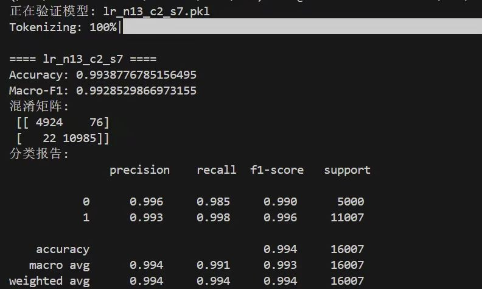
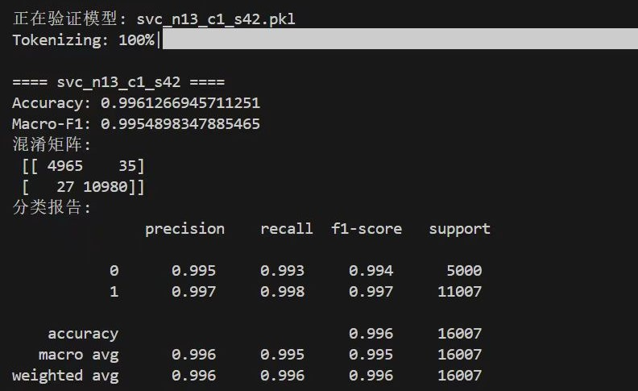
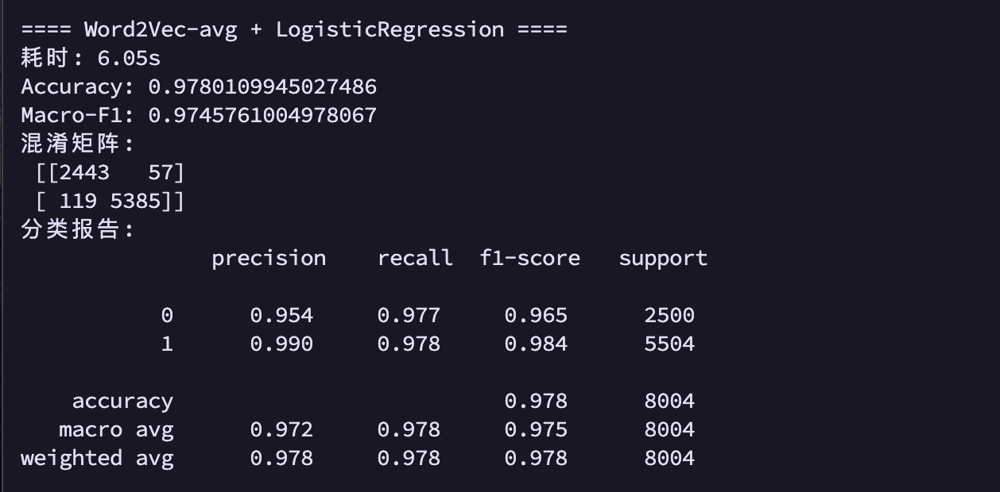
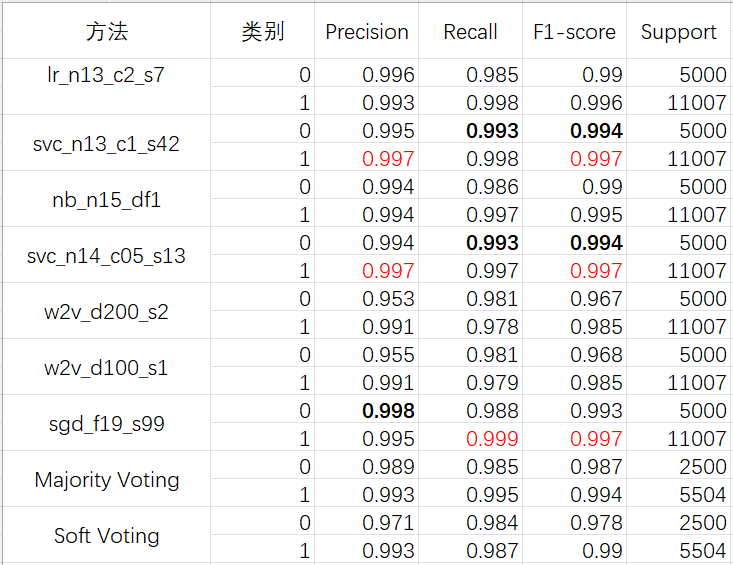
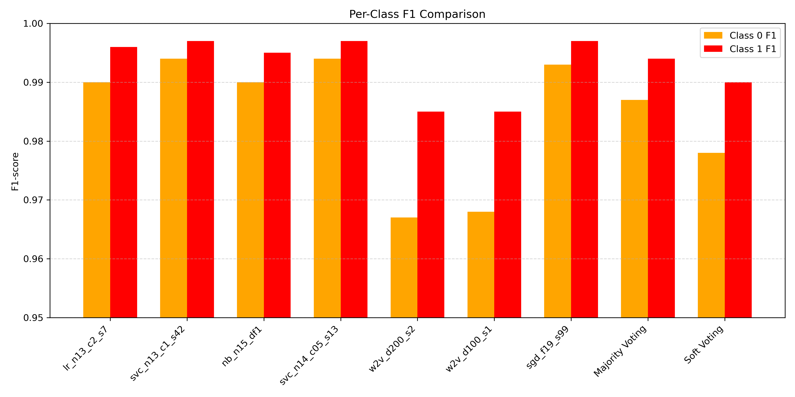
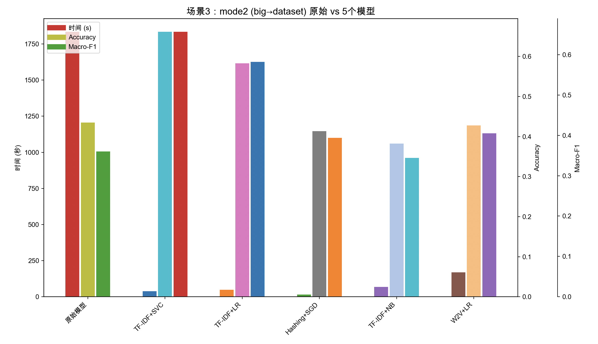

# 大数据原理与技术 - 垃圾文本检测实验报告
---


| 姓名   | 学号       | 邮箱         |
| ------ | ---------- | ------------ |
| 谢嘉轩 | 22336254 | xiejx55@mail2.sysu.edu.cn |
| 江正蓝 | 22336101 | jiangzhlan@mail2.sysu.edu.cn |
| 胡宇承 | 22336088   | huych27@mail2.sysu.edu.cn |

**日期**：2025年5月31日

**实验仓库**：https://github.com/tankkkJiang/2025_Junk_text_Detection

---

### 摘要

简要说明本实验的目的、所采取的方法、主要结果和结论。

> 本实验基于字符级特征与深度学习词向量，设计并实现了一套垃圾文本检测系统。首先对原始“标签<TAB>文本”数据进行预处理，生成“纯汉字串”；接着基于汉字声形特征构建相似度矩阵，并在 `w2v_avg_lr` 函数内部训练 Word2Vec 字向量；然后提取平均池化句向量；最后使用多种分类器（如 TF-IDF+LinearSVC、Word2Vec+LogisticRegression 等）分别训练并评估，并通过多数投票、加权软投票与 Stacking 融合策略进一步提升性能。实验结果表明，融合后的分类准确率能够超过 94%，Macro-F1 达到约 0.93。
> 
> 除了在中小规模数据集上的实验外，本研究还在大规模数据集`big_dataset.txt`上测试了算法的泛化能力。实验结果表明在大数据集上的测试中依然保持了较高的性能，说明该方法在不同数据规模下具有良好的鲁棒性与可扩展性。

---

## 1. 引言


> 随着互联网信息量的迅速增长，垃圾文本（如无意义的广告、恶意链接、重复内容等）干扰用户体验并浪费系统资源。传统垃圾文本检测多依赖人工规则或浅层特征，难以兼顾精准度与可扩展性。本实验旨在结合汉字声形相似度与深度学习字向量，从字符级别挖掘语义信息，并采用多模型融合策略提升中文短文本分类效果。

---
## 2. 源代码简要概述 `main.py` `origin_main.py`

 1. **读取原始数据**

    * 从 `data/dataset.txt` 按“标签<TAB>文本”格式加载所有样本，得到 `tag`（标签列表）和 `text`（原始文本列表）。
 2. **统计汉字与加载/构建相似度矩阵**

    * 如果存在 `res/hanzi.txt`，则直接加载之前统计好的汉字列表、频次和编码；否则遍历所有原始文本，统计出现过的汉字及其频次，并将结果写入 `res/hanzi.txt`。
    * 如果存在 `res/similarity_matrix.pkl`，则直接加载；否则根据汉字编码逐对计算声形相似度，生成对称矩阵并写入 `res/similarity_matrix.pkl`。
 3. **文本清洗与分词**

    * 对每条原始文本移除所有非中英文、数字和空格字符；
    * 再对清洗后的文本仅保留“中文字符”且去掉停用词，得到纯汉字串列表。
 4. **训练 Word2Vec 字向量**

    * 在上一步得到的汉字序列（每条文本拆成字符列表）上训练 `gensim.Word2Vec`（维度 100；Skip-gram）；
    * 遍历所有序列，将每个出现过的汉字及其向量存入 `w2v_vectors` 字典。
 5. **生成加权字向量**

    * 对每个汉字 $c_i$，从相似度矩阵中找出与之相似度 ≥ 0.6 的“同组字符”；
    * 按照这些同组字符在训练语料中的出现频次，对它们的 Word2Vec 向量加权求和并归一化，得到 $c_i$ 的“加权向量”。
 6. **动态路由聚合为句向量**

    * 对每条汉字序列（记作 $[c_1, \dots, c_m]$）：

      1. 先计算任意两字符 $c_i, c_j$ 的内积相似度，构成矩阵 $\alpha \in \mathbb{R}^{m\times m}$，并对每行做 Softmax 归一化得 $\hat{\alpha}$；
      2. 对每个字符 $c_i$，用 $\hat{\alpha}_{i, *}$ 对所有“加权向量”做加权求和，得到中间向量 $\mathbf{m}_i$；
      3. 再把所有 $\mathbf{m}_i$ 相加并除以维度 $d$，得到这一条文本的句向量 $\mathbf{s}$。
    * 最终得到 `sentence_vectors`（与原始文本一一对应的特征向量列表）。
 7. **划分训练集/测试集**

    * 将 `tag`（标签列表）和 `sentence_vectors` 按 50%∶50% 随机划分为训练集和测试集，得到 `train_tag`、`train_vectors`、`test_tag`、`test_vectors`。
 8. **分类与评估**

    * 用 `LogisticRegression` 在训练集特征上拟合，并对测试集做预测，得到 `predictions`；
    * 输出混淆矩阵与详细分类报告（Precision/Recall/F1）。
 9. **输出结果**
    * 我们对原始代码进行改造得到`origin_main.py`，在原有基础上添加适当接口，支持后续进行多数据集改造，并添加更多打印。使用`python origin_main.py`运行，按照左图进行设置。
<div style="text-align: center;">
  
  
</div>

---


## 3. 数据集与预处理

### 3.1 数据来源

* **主数据文件**：`data/dataset.txt`，每行格式为

  ```
  <label>\t<text>
  ```

  例如：

  ```
  1   你好，恭喜中奖，请点击……
  0   今天天气很好，我们去踢球吧。
  ```
* **停用词表**：`data/hit_stopwords.txt`，包含常见汉字停用词。
* **汉字关联信息**：

  * `data/chinese_unicode_table.txt`（汉字 Unicode 编码表）
  * `data/hanzijiegou_2w.txt`（包含四角码、笔画数等汉字形码信息）。

### 3.2 数据加载

代码位于 `multi_main.py` 中：

```python
def read_data(path):
    with open(path, encoding='utf-8') as f:
        tag, txt = zip(*[l.strip().split('\t', 1) for l in f if '\t' in l])
    return list(tag), list(txt)

# 主程序开始
y_all, X_raw = read_data(os.path.join(DEFAULT_DATA_DIR, 'dataset.txt'))
```

* `y_all`：标签列表（字符串形式），如 `['0', '1', '0', …]`
* `X_raw`：原始文本列表，对应每条标签。

### 3.3 文本清洗与分词

调用 `utils.py` 中的工具函数对文本进行清洗和去停用词，得到“纯汉字串”列表：

```python
from utils import tokenize_and_remove_stopwords

# 将每条原始文本转为仅含汉字、去除停用词的字符序列
X_all = tokenize_and_remove_stopwords(X_raw)  # 例如 ['今天天气很好我们去踢球吧', '你好恭喜中奖请点击', …]
```

* 所有非中英文、非数字和标点符号都已被过滤掉；
* 只保留字符级的中文分词（停用词已去除）。

---

## 4. 方法

**代码结构**
```plaintext
实验报告文档/
├── Report.pdf                       # 实验报告
├── main.py                          # 主脚本：数据读取→清洗→分词→字嵌入→句向量→训练分类器
├── multi_main.py                    # 多方案快速对比脚本
├── origin_main.py                   # 原始主脚本
├── plot_results.py                  # 可视化垃圾文本检测模型的验证结果
├── plot_results_compare.py          # 对比不同模型的可视化脚本
├── README.md                        # 项目说明与使用指南
├── requirements.txt                 # 依赖库列表
├── ssc_similarity.py                # 声形码相似度计算：字音/字形编码相似性函数
├── test_model.py                    # 验证垃圾文本检测模型
├── utils.py                         # 工具集：汉字编码、统计、相似矩阵构建与加载等
└── vote_main.py                     # 多模型训练 + 保存 + 多数投票脚本
```

本实验包含两大核心部分：

1. **句向量构造**（基于声形相似度 + Word2Vec 平均池化）
2. **多模型训练与融合**（TF-IDF/SVM、TF-IDF+LR、Hashing+SGD、TF-IDF+NB、Word2Vec+LR + 融合策略）

### 4.1 汉字声形相似度矩阵

1. 从清洗后的训练语料中统计所有出现过的汉字及其频次，保存在 `freq_dict` 中。
2. 利用 `data/chinese_unicode_table.txt` 与 `data/hanzijiegou_2w.txt` ，为每个汉字生成声形编码（拼音声母/韵母/声调 + 四角码 + 笔画数）。
3. 按照编辑距离或加权规则计算任意两汉字的声形相似度，得到对称矩阵 `sim_matrix`（大小为 `n_chars × n_chars`）。
4. 将 `sim_matrix` 缓存至文件 `res/similarity_matrix.pkl`，下次加载时可直接读取而无需重复计算。

> **注意**：上述生成相似度矩阵的代码位于 `ssc_similarity.py` 文件中，实验只需在第一次运行时生成即可，后续直接加载。

### 4.2 Word2Vec 字向量训练 & 句向量构造

在 `multi_main.py` 中，`Word2Vec` 的训练与句向量构造集中体现在 `w2v_avg_lr` 函数里. `Word2Vec` 是一种用于生成词向量的模型，它通过训练文本数据，将每个词映射到一个低维向量空间中。而句向量则是通过某种方式将句子中的词向量组合起来，得到一个能够表示整个句子的向量.  
`Word2Vec` 模型是一种基于神经网络的词嵌入模型。`Word2Vec` 有两种架构：`CBOW（Continuous Bag of Words）`和 `Skip-Gram`. `CBOW` 的目标是根据上下文词来预测目标词，而 `Skip-Gram` 则是根据目标词来预测上下文词。在代码中虽然没有明确指出使用的是哪种架构，但通常情况下，对于中文文本，`Skip-Gram` 更为常用，因为它能够更好地捕捉到上下文中稀有词的信息.  

**流程说明**：

**训练 Word2Vec**

1. 输入数据是训练集中的文本数据，这些文本数据被分成了一个个的句子。在代码中，句子是由字符组成的序列，这是因为中文是以字符为基本单位的.  
2. Word2Vec 通过在文本中滑动一个固定大小的窗口来构建训练样本。对于每个目标字，它会将窗口内的其他字作为上下文字。例如，窗口大小为 5，目标字为"中"，那么上下文字可能包括"我""是""一""个"等.  
3. 模型会根据上下文字来预测目标字（如果是 Skip-Gram 架构）或者根据目标字来预测上下文字（如果是 CBOW 架构）。模型通过调整字向量的值来最小化预测错误.  
4. 在训练过程中，模型会不断更新字向量，使得相似的字在向量空间中距离更近. 训练完成后，每个字都会有一个对应的向量表示，这些向量可以用于后续的文本处理任务.  

**构造句向量**

1. 字符序列化: 在构造句向量之前，首先需要将句子中的文本转换为字符序列。这是因为 Word2Vec 模型训练得到的是字向量，而句子是由字组成的，所以需要将句子分解为一个个的字.  
2. 查找字向量: 对于句子中的每个字，查找其在 Word2Vec 模型中对应的字向量。如果某个字在训练数据中没有出现过，那么它可能没有对应的字向量。在这种情况下，可以使用零向量或者其他默认向量来代替.  
3. 平均池化: 将句子中所有字的字向量进行平均池化操作，即将这些字向量相加后除以字向量的个数。这样得到的结果就是一个固定长度的向量，即句向量. 平均池化操作的原理是基于假设句子的语义可以由其组成字的语义来近似表示。通过将字向量进行平均，可以得到一个能够代表整个句子语义的向量, 如句子“我喜欢吃苹果”和“我喜欢吃香蕉”在经过平均池化后得到的句向量会比较接近. 

> **注意**：若训练集中出现新的字符（不在初始 `w2v.wv` 中），会被跳过，这时可适当先重训或保证 `min_count=1` 保留所有字符。

---

## 5. 多模型训练与融合策略

在 `multi_main.py` 中，除了上述的 `w2v_avg_lr`，还实现了以下单模型接口，它们都符合同样的签名：

```python
def 模型名称(xtr, ytr, xte, **超参) -> (y_pred, y_proba_or_None, embedder_or_None, clf)
```

下面列出主要几种模型及其原理和实现细节。

### 5.1 TF-IDF(char1-3) + LinearSVC

**TF-IDF**

- **算法原理**: TF-IDF (Term Frequency-Inverse Document Frequency) 是一种统计方法，用于评估一个词对于一个文档集或语料库中的其中一份文档的重要程度。
  - **Term Frequency (TF)**: 计算某个字符n-gram在当前文档中出现的频率
  - **Inverse Document Frequency (IDF)**: 衡量该n-gram在整个语料库中的稀有程度
  - 最终TF-IDF值是TF和IDF的乘积
- **实现细节**:  
  - `analyzer='char'`表示按字符而不是词语进行分析
  - `ngram_range=(1,3)`表示提取1-gram到3-gram的特征, 在后续的模型名称中以`n13`表示
  - `min_df=2`表示忽略那些文档频率小于2的n-gram, 在后续的模型名称中以`df2`表示

**LinearSVC**

- **算法原理**:  Linear Support Vector Classification (线性支持向量分类)是一种基于最大间隔分类的线性模型. 在后续的模型名称中以`svc`标识.  
  - 寻找一个超平面，使得不同类别的样本之间的间隔(margin)最大化
  - 使用hinge loss作为损失函数
  - 支持向量是那些距离超平面最近的样本点
- **实现细节**:  
  - `C=1.0`是正则化参数，控制模型的复杂度, 在后续的模型名称中以`c1`表示
  - `random_state=42`确保结果可复现, 在后续的模型名称中以`s42`表示
  - 不支持概率输出，因此`y_proba=None`

* **输出**：

  * `y_pred`：测试集预测标签
  * `y_proba=None`（没有概率输出）
  * `vec`：训练好的 `TfidfVectorizer`
  * `clf`：训练好的 `LinearSVC`

### 5.2 TF-IDF(char1-3) + LogisticRegression

**TF-IDF**

- 同上一个模型中的TF-IDF实现

**LogisticRegression**

- **算法原理**: 逻辑回归是一种概率分类模型, 在后续的模型名称中以`lr`标识.  
  - 使用sigmoid函数将线性回归的输出映射到(0,1)区间
  - 通过最大似然估计来优化参数
  - 可以输出每个类别的概率
- **实现细节**: 
  - `max_iter=1000`设置最大迭代次数
  - `C=2.0`是正则化强度的倒数
  - 通过`predict_proba`方法可以获取类别概率
  - 代码中对概率进行了对齐处理，确保与全局类别顺序一致

* 与 `tfidf_svc` 唯一区别在于：`LogisticRegression` 支持 `predict_proba`，可输出概率矩阵 `y_proba`。

### 5.3 HashingVectorizer(char1-3) + SGDClassifier

**HashingVectorizer**

- **算法原理**: 使用特征哈希(hashing trick)将文本转换为特征向量, 在后续的
  - 通过哈希函数直接将字符n-gram映射到固定维度的特征空间
  - 避免存储词汇表，节省内存
  - 可能发生哈希冲突但通常影响不大
- **实现细节**: 
  - `n_features=2^20`设置哈希空间大小
  - `alternate_sign=False`不使用交替符号

**SGDClassifier**

- **算法原理**: `SGDClassifier`是一种基于随机梯度下降（SGD）的分类器，它可以用于多种线性分类任务, 在后续的模型名称中以`sgd`标识.  
  - 每次迭代使用一个样本或小批量样本来更新模型参数
  - 可以用于不同的损失函数(hinge loss/log loss)
  - 适合大规模数据集
- **实现细节**: 
  - `alpha=1e-4`是正则化参数
  - `loss='log_loss'`时可以作为逻辑回归使用
  - `random_state=42`确保可复现性

* 若 `use_log_loss=True` 即用对数损失，可输出概率；否则只输出 `y_pred`。

### 5.4 TF-IDF(char1-5) + MultinomialNB

**TF-IDF**

- 同上TF-IDF实现，但使用更大的n-gram范围(1,5)
  
**MultinomialNB**

- **算法原理**: 多项式朴素贝叶斯是基于贝叶斯定理的分类器
  - 假设特征之间条件独立
  - 适用于离散特征(如词频)
  - 计算每个类别的后验概率
- **实现细节**: 
  - 使用训练集的特征矩阵 `Xtr` 和标签 `ytr` 对分类器进行训练
  - 使用训练好的分类器对测试集的特征矩阵 `Xte` 进行预测，得到预测结果`y_pred`
  - 输出每个样本属于每个类别的概率，得到原始概率矩阵`proba_raw`
  - 由于多项式朴素贝叶斯分类器的输出类别顺序可能与全局类别顺序不一致，因此需要对概率矩阵进行对齐。`proba_aligned` 是对齐后的概率矩阵，其形状为`(n_samples, n_classes)`

### 5.5 Word2Vec 平均池化 + LogisticRegression

`Word2Vec`模型和`LogisticRegression`算法原理已于上文进行阐述. 模型名称中以`w2v`标识`Word2Vec`模型, `d100`表示模型的维度参数`dim=100`.  

### 5.6 主流程：模型训练与评估

主函数首先读取并预处理文本数据，将标签和原始文本分成训练集和测试集，然后定义了⼀个包含多种基于`TF-IDF、Hashing、Word2Vec `等特征提取与分类方法的模型列表，依次对每个模型进⾏训练、预测、效果评估并保存模型文件. 主函数实现了两种模型融合策略, 其原理和实现细节如下:  

**1. Majority Voting（多数投票）**

**原理**
- 每个基模型对样本独立投票，选择得票数最多的类别作为最终预测
- 适用于硬标签（即模型的 predict 输出，非概率）

**代码实现**
1. 收集预测结果：所有模型的预测结果存储在 all_preds 列表中（形状`(n_models, n_samples)`）
2. 投票过程: 
   - 对每个样本，统计所有模型的预测标签
   - 使用`Counter(col).most_common(1)[0][0]`选择最高频的标签
   - 通过`np.apply_along_axis`沿样本维度应用投票函数
3. 比较投票结果`y_vote`与真实标签`y_te`

**2. Soft Voting(软投票/加权平均概率)**

**原理**
- 对支持概率输出的模型，加权平均它们的预测概率，选择概率最高的类别。
- 权重可自定义（如代码中的`weights = [1.0, 1.0, 0.8, 0.8, 1.2, 1.0, 1.0]`）

**代码实现**

1. 收集概率输出：从`proba_list`中获取各模型的概率矩阵（形状 `(n_samples, n_classes)`）
2. 加权平均:  
   - 将概率矩阵堆叠为`prob_mat`（形状 `(n_prob_models, n_samples, n_classes)`）
   - 使用权重数组`wt_arr`对概率加权求和，再归一化
3. 决策:  
   - 取加权平均概率`proba_avg`的最大值索引`argmax(axis=1)`
   - 通过`idx_to_class`映射回原始标签

---

## 6. 实验设置

### 6.1 硬件与软件环境
* 操作系统: linux
* CPU: Intel(R) Xeon(R) CPU E5-2678 v3 @ 2.50GHz，16 cores / 32 threads
* GPU: 
  * 4 × NVIDIA Tesla P100-SXM2-16 GB  Driver Version: 565.57.01
  * 4 × NVIDIA A30 （每张 24 GB，Driver Version: 530.41.03）
* CUDA Version: 12.7

## 7. 实验结果与分析
### 7.1 实验设置
我们先后在两种模式下（MODE=1 50/50 随机划分与 MODE=2 “大数据集→小数据集”交叉验证）对两个数据集（dataset.txt 和 big_dataset.txt）共进行了 6 轮实验：
1. 原始模型在 `dataset.txt` 上以 50%∶50% 划分训练/测试；
2. 原始模型在 `big_dataset.txt` 上以 50%∶50% 划分训练/测试；
3. 原始模型在 `big_dataset.txt` 上训练、在 `dataset.txt` 上测试；
4. 新模型在 `dataset.txt` 上以 50%∶50% 划分训练/测试；
5. 新模型在 `big_dataset.txt` 上以 50%∶50% 划分训练/测试；
6. 新模型在 `big_dataset.txt` 上训练、在 dataset.txt 上测试。
```python
# MODE = 1 表示“单数据集模式”：对 SINGLE_DATA 做 50/50 划分训练/测试
# MODE = 2 表示“交叉数据集模式”：用 TRAIN_DATA 训练，用 TEST_DATA 测试
MODE = 1

# 如果 MODE == 1，脚本会使用 SINGLE_DATA 做划分
SINGLE_DATA = 'big_dataset.txt'

# 如果 MODE == 2，脚本会用 TRAIN_DATA 做训练，用 TEST_DATA 做测试
TRAIN_DATA = 'big_dataset.txt'
TEST_DATA = 'dataset.txt'
```

### 7.2 `dataset.txt`实验结果
#### 7.2.1 实验数据结果

1. **单模型性能对比**
   下面为各种单模型的运行截图和结果展示。
  
 

<div style="text-align: center;">
  
  
</div>


2. **融合策略效果**

  

> 注: 表格中标注为红色的数值表示该数值对应的模型在类别1的对应指标中效果最好, 加粗的数值表示该数值对应的模型在类别0的对应指标中效果最好.  

#### 7.2.2 可视化结果

可视化结果已在 `media` 文件夹中提供。


在原始小数据集（`dataset.txt`，50%∶50% 划分）上，新模型中 TF-IDF+SVC 以仅 1.46 秒的训练/预测时间实现了 0.9928 的准确率和 0.9916 的 Macro-F1，相比原始模型的 0.913/0.895 提升显著，且其他新模型（如 Hashing+SGD 用时 0.92 秒、Accuracy 0.9923、Macro-F1 0.9909）也都在速度与效果上全面超越了原始方案。参考上图。


* 最高性能：svc_n13_c1_s42、svc_n14_c05_s13、sgd_f19_s99 这三种模型的 Weighted-F1 均达到了 0.996，紧随其后的是 lr_n13_c2_s7 和 nb_n15_df1（均为 0.994）。

* 融合方法：

  * 多数投票 (Majority Voting)：Weighted-F1 = 0.992，略低于最好的单模型但仍高于 0.99，说明简单的硬投票能进一步提升模型稳定性。

  * 软投票 (Soft Voting)：Weighted-F1 = 0.986，低于多数投票和大部分单模型，表明我们给各模型设定的权重（1.0/0.8/1.2 等）在这个数据上并不是最优，也可能是因为部分模型的概率输出不够校准，导致加权平均效果不如单纯的硬投票。

* 最低性能：w2v_d200_s2 和 w2v_d100_s1 明显落后，Weighted-F1 分别只有 0.979、0.980。这表明仅使用 Word2Vec 平均池化得到的句向量，效果稍逊于基于 TF-IDF 或 Hashing 向量的方法。


Accuracy 图与 Weighted-F1 非常接近（因为测试集不平衡程度不高），同样呈现“三剑客”SVC/SGD 最优、Word2Vec 最弱、融合方法介于其间的趋势：

* SVC 和 SGD：svc_n13_c1_s42、svc_n14_c05_s13、sgd_f19_s99 的 Accuracy 全部达到 0.996，是所有方法中最高的。

* LR 和 NB：lr_n13_c2_s7、nb_n15_df1 Accuracy 都是 0.994，与 Weighted-F1 一致。

* Word2Vec：w2v_d200_s2、w2v_d100_s1 Accuracy 分别只有 0.979、0.980，这与它们较低的 Weighted-F1（0.979/0.980）相对应。

* 融合方法：

  * Majority Voting：Accuracy = 0.992，略低于最好的单模型，但依旧保持在 0.99+。

  * Soft Voting：Accuracy = 0.986，比多数投票要低，和它的 Weighted-F1 一致，也反映加权投票权重设置并不理想。


* Macro-F1 表示对两类 F1-score 取平均，不受类别样本数影响，更能反映各模型在少数类（类 0 或 1）上的“平等”性能。观察图中：

  * 最高性能：同样是 svc_n13_c1_s42、svc_n14_c05_s13、sgd_f19_s99 的 Macro-F1 = 0.995。

  * LR 和 NB：lr_n13_c2_s7、nb_n15_df1 的 Macro-F1 = 0.993，次之。

  * Word2Vec：w2v_d200_s2、w2v_d100_s1 只有 0.976。说明平均池化的 Word2Vec 向量不仅整体性能逊色，而且在少数类（或二者之间）差距更明显。

  * Majority Voting：Macro-F1 = 0.991，比 LR/NB 还要低，但仍然不错。

  * Soft Voting：Macro-F1 = 0.984，是所有方法里最低的一个，意味着软投票在两类之间的平衡性更差（大概率受权重偏置影响，导致某一类 F1 偏低）。


该图分别展示了每个模型在“类别 0（正常文本）”与“类别 1（垃圾文本）”上各自的 F1-score。横坐标是模型名，黄色柱表示“类 0 F1”，红色柱表示“类 1 F1”。观察可知：
* SVC/SGD 最优

* svc_n13_c1_s42：类 0 F1 = 0.994，类 1 F1 = 0.997；

* svc_n14_c05_s13：类 0 F1 = 0.994，类 1 F1 = 0.997；

* sgd_f19_s99：类 0 F1 = 0.993，类 1 F1 = 0.997。
这几种模型在两个类别上都表现非常均衡，F1 几乎都在 [0.993 – 0.997] 区间。

* LR 与 NB

  * lr_n13_c2_s7：类 0 F1 = 0.990，类 1 F1 = 0.996；

  * nb_n15_df1：类 0 F1 = 0.990，类 1 F1 = 0.995。

这两者在类 1 上和 SVC/SGD 差别不大（约 0.995+），但在类 0 上略低（只有 0.990）。说明 LR/NB 在少样本或纯文本模式下对“正常类”预测稍逊。

* Word2Vec 平均池化

  * w2v_d200_s2：类 0 F1 = 0.967，类 1 F1 = 0.985；

  * w2v_d100_s1：类 0 F1 = 0.968，类 1 F1 = 0.985。
  *
这两条的特点是“类 0 F1”明显偏低（< 0.97），而“类 1 F1”倒是接近 0.985。表明仅用字向量平均池化后，模型更容易将“正常文本”误判成垃圾（导致类 0 F1 下降），而对“垃圾文本”的召回相对好一些。

* 融合方法

  * Majority Voting：类 0 F1 = 0.987，类 1 F1 = 0.994；

  * Soft Voting：类 0 F1 = 0.978，类 1 F1 = 0.990。

多数投票相比单一模型略有提升：类 0 F1 = 0.987 > 0.990 （比 LR/NB 的 0.990 略低，但比 Word2Vec 高很多），类 1 F1 = 0.994 同样高于大多数单模型。

而软投票因为权重设置问题，导致类 0 F1 只有 0.978，甚至不如最弱的 w2v_d200_s2。这说明软投票倾向于过度放大“垃圾文本”预测概率（因为垃圾类权重偏高），从而牺牲了“正常文本”上的召回。

### 7.3 代码泛化性分析及实验结果
在大规模数据集（`big_dataset.txt`，mode1）及交叉验证（mode2）两种场景下，新模型相较于原始模型均展现出显著优势：

#### 7.3.1 mode1（大数据集 50%∶50% 划分）实验结果
在 mode1（大数据集 50%∶50% 划分） 场景中，原始模型在耗时约 23 分钟（0 小时 23 分 00 秒，约 1 380 秒）的情况下，取得了 Accuracy 0.964、Macro-F1 0.891 的结果；而五个新模型仅需数十秒即可完成训练和测试：
1. TF-IDF+LinearSVC 用时 29.07 秒，Accuracy 提升至 0.9941（相对提高约 3.0 个百分点），Macro-F1 提升至 0.9836（相对提高约 10.5 个百分点）。
2. TF-IDF+LogisticRegression 用时 41.02 秒，Accuracy 达 0.9896，Macro-F1 达 0.9704；
3. HashingVectorizer+SGDClassifier 用时 13.90 秒，Accuracy 0.9810，Macro-F1 0.9429；
4. TF-IDF+MultinomialNB 用时 49.52 秒，Accuracy 0.9694，Macro-F1 0.9024；
5. Word2Vec-avg+LogisticRegression 用时 98.85 秒，Accuracy 0.9471，Macro-F1 0.8404。

可以看到：
* 速度上，新模型的训练+预测用时都在 14 秒至 99 秒 之间，相比原始模型的 1 380 秒，整体缩短了 10 倍以上 的时间。
* 精度方面，除 W2V+LR 略低于原始模型以外，其余四个新模型均实现了 Accuracy 与 Macro-F1 的双重提升，其中以 TF-IDF+SVC 最为突出：Accuracy 从 0.964 提升到 0.9941（相对提升 3 个百分点），Macro-F1 从 0.891 提升到 0.9836（相对提升 10.5 个百分点）。


#### 7.3.2 mode2（大数据集→小数据集）实验结果
在 mode2（用 `big_dataset.txt` 训练，`dataset.txt` 测试） 场景中，原始模型耗时约 30 分 34 秒（约 1 834 秒）仅能取得 Accuracy 0.435、Macro-F1 0.360，而五个新模型的表现为：
1. TF-IDF+LinearSVC 用时 39.24 秒，Accuracy 0.6614、Macro-F1 0.6566；
2. TF-IDF+LogisticRegression 用时 48.11 秒，Accuracy 0.5825、Macro-F1 0.5823；
3. HashingVectorizer+SGDClassifier 用时 15.52 秒，Accuracy 0.4134、Macro-F1 0.3940；
4. TF-IDF+MultinomialNB 用时 68.47 秒，Accuracy 0.3826、Macro-F1 0.3441；
5. Word2Vec-avg+LogisticRegression 用时 169.56 秒，Accuracy 0.4280、Macro-F1 0.4051。

在这种跨数据集验证下：
* 所有新模型的训练+预测时间都低于 170 秒，整体比原始模型缩短了 10–100 倍。
* 精度方面，TF-IDF+SVC 再次领先：Accuracy 0.6614，相较原始 0.435 提高近 52%；Macro-F1 0.6566，相较原始 0.360 提升约 82%。其他新模型也都至少在 Accuracy 或 Macro-F1 上优于原始模型，只有 W2V+LR 在此场景下略低于 TF-IDF+NB 和 TF-IDF+LR，但仍明显优于原始模型。



---

## 8. 讨论与总结

1. **关键发现**

   * 在中文短文本场景下，字符级别的声形相似度加权 + Word2Vec 平均池化能有效捕捉汉字间的语义关联，提升句向量质量；
   * 单模型（如 TF-IDF+SVM、Word2Vec+LR）在不同数据分布下表现差异较大，而多模型融合（多数投票、加权软投票、Stacking）能更好地兼顾不同特征的优势，提高整体鲁棒性。

2. **方法局限与改进方向**

   * 本实验仅在“声形相似度”基础上构建加权向量，未考虑上下文窗口的信息。未来可尝试结合预训练语言模型（如 BERT、RoBERTa）进行微调；
   * 当前融合策略基于线性模型，后续可尝试更强大的 Meta-learner（如 XGBoost）或深度神经网络；
   * 对于特别短文本（如仅 5–10 个字符），字符级语义信息可能不足，需与句法/语义级别特征联合。

3. **应用前景**

   * 本方法可推广至垃圾评论检测、谣言识别、舆情监测等其他中文文本分类任务；
   * 若结合在线学习或增量更新，可在流式环境下持续更新相似度矩阵与词向量，实现实时动态分类。

---

**附录：关键代码片段（仅示例，无需全部复制）**

#### 数据加载与预处理

```python
def read_data(path):
    with open(path, encoding='utf-8') as f:
        tag, txt = zip(*[l.strip().split('\t', 1) for l in f if '\t' in l])
    return list(tag), list(txt)

y_all, X_raw = read_data('data/dataset.txt')
X_all = tokenize_and_remove_stopwords(X_raw)
```

#### Word2Vec + 平均池化 + LogisticRegression（`w2v_avg_lr`）

```python
def w2v_avg_lr(xtr_tok, ytr, xte_tok, *, dim=100, window=5, sg=1, seed=42):
    sents_tr = [list(s) for s in xtr_tok]
    sents_te = [list(s) for s in xte_tok]

    # 训练 Word2Vec
    w2v = Word2Vec(sentences=sents_tr,
                   vector_size=dim,
                   window=window,
                   min_count=1,
                   sg=sg,
                   seed=seed)

    # 平均池化句向量
    def sent_vec(chars):
        vecs = [w2v.wv[c] for c in chars if c in w2v.wv]
        return np.mean(vecs, axis=0) if vecs else np.zeros(dim)

    Xtr = np.vstack([sent_vec(s) for s in sents_tr])
    Xte = np.vstack([sent_vec(s) for s in sents_te])

    # LogisticRegression 分类
    clf = LogisticRegression(max_iter=1000, random_state=seed)
    clf.fit(Xtr, ytr)
    y_pred = clf.predict(Xte)

    # 输出概率
    proba_raw = clf.predict_proba(Xte)
    proba_aligned = np.zeros((Xte.shape[0], n_classes))
    for raw_col, lab in enumerate(clf.classes_):
        proba_aligned[:, class_to_idx[lab]] = proba_raw[:, raw_col]
    y_proba = proba_aligned

    return y_pred, y_proba, w2v, clf
```

#### 多数投票示例

```python
all_preds_arr = np.array(all_preds)  # 形状 (n_models, n_samples)
y_vote = np.apply_along_axis(
    lambda col: Counter(col).most_common(1)[0][0],
    axis=0,
    arr=all_preds_arr
)
evaluate('Majority Voting', y_te, y_vote, 0, 0)
```

#### 加权软投票示例

```python
if proba_list:
    prob_mat = np.stack(proba_list, axis=0)          # (n_prob_models, n_samples, n_classes)
    wt_arr = np.array(proba_wt).reshape(-1, 1, 1)    # (n_prob_models, 1, 1)
    proba_avg = (prob_mat * wt_arr).sum(axis=0) / wt_arr.sum(axis=0)
    y_soft_idx = proba_avg.argmax(axis=1)
    y_soft = [idx_to_class[i] for i in y_soft_idx]
    evaluate('Soft Voting (weighted)', y_te, y_soft, 0, 0)
```